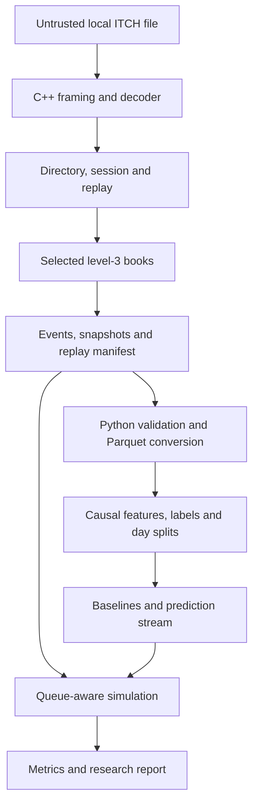
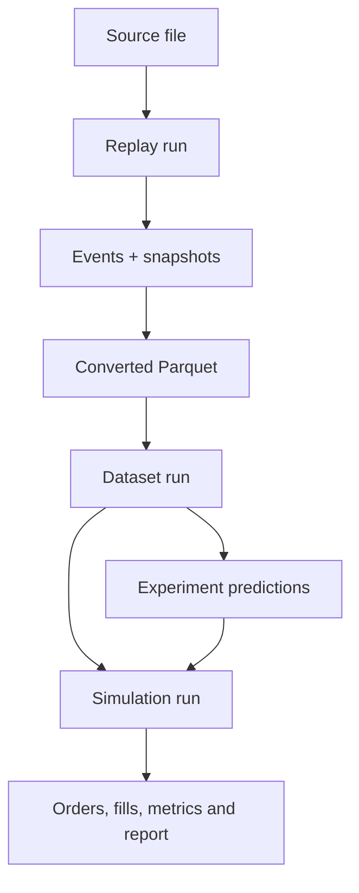
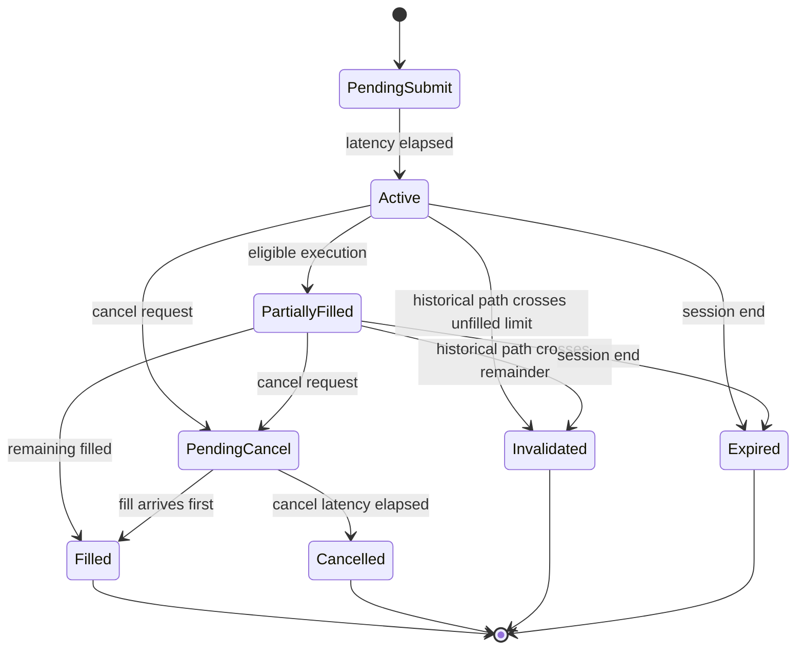

# ITCH-Lab — Consolidated project specification

> This is a secondary human-readable consolidation. The individual documents in docs/, accepted ADRs and requirement traceability matrix are authoritative.

## Proposed directory tree

    itch-lab/
    ├── README.md
    ├── AGENTS.md
    ├── CLAUDE.md
    ├── TASKS.md
    ├── CMakeLists.txt
    ├── CMakePresets.json
    ├── configs/
    ├── cpp/
    │   ├── apps/itchlab/
    │   ├── include/itchlab/
    │   └── src/
    ├── data/
    │   ├── raw/            # ignored
    │   ├── derived/        # ignored
    │   └── fixtures/       # synthetic only
    ├── docs/
    │   ├── 00-project-overview.md
    │   ├── 01-product-requirements.md
    │   ├── 02-user-flows.md
    │   ├── 03-system-architecture.md
    │   ├── 04-data-model.md
    │   ├── 05-api-contracts.md
    │   ├── 06-frontend-specification.md
    │   ├── 07-security-and-privacy.md
    │   ├── 08-testing-strategy.md
    │   ├── 09-deployment.md
    │   ├── 10-implementation-plan.md
    │   ├── 11-traceability.md
    │   └── decisions/
    ├── python/
    │   ├── pyproject.toml
    │   ├── requirements-dev.lock
    │   ├── requirements-release.lock
    │   ├── src/itchlab_research/
    │   └── tests/
    ├── runs/               # ignored except small documented examples
    ├── schemas/
    └── tests/

## Status and classification

Status: implementation-ready specification; application implementation has not started.

- **Confirmed requirement**: accepted through selection of the ITCH-Lab concept.
- **Assumption**: planning premise requiring confirmation/evidence.
- **Recommendation**: chosen initial technical mechanism.
- **Deferred decision**: deliberately excluded from MVP.

## Executive summary

ITCH-Lab is an offline quantitative-research platform that streams Nasdaq TotalView-ITCH 5.0 files, safely decodes event-level market data, reconstructs selected instruments' visible level-3 order books and produces reproducible research artefacts. A Python layer then investigates whether order-flow information predicts short-horizon mid-price movement and whether that information survives a conservative historical market-making simulation that includes visible queue position, action latency, costs and inventory risk.

The project is an engineering and research demonstration. It is not a live-trading system, a Nasdaq matching-engine replica, financial advice or evidence that a strategy would earn live profits.

## Problem and value

Typical portfolio “trading bots” use daily candles, random train/test splits and immediate fills. Those choices conceal the hard problems and often generate meaningless backtests.

ITCH-Lab deliberately exposes:

- Binary protocol parsing and safe C++ systems work.
- Stateful level-3 book data structures and invariants.
- Large-file streaming and profiling.
- Causal feature engineering and chronological validation.
- Queue/latency/cost assumptions.
- Reproducibility, negative results and limitations.

Target personas are a systems developer, quantitative researcher and technical reviewer. They are documentation personas rather than authenticated accounts.

## Product goals

1. Decode the required ITCH 5.0 subset safely and correctly.
2. Reconstruct full visible order state for configured symbols.
3. Produce validated, versioned event and top-N snapshot artefacts.
4. Build causal datasets using complete chronological trading-day splits.
5. Compare transparent predictive baselines.
6. Simulate inventory-aware passive quoting under explicit execution assumptions.
7. Measure and explain performance.
8. Make every published result traceable to input hashes, config and code.

## Non-goals

- Live SoupBinTCP/MoldUDP64 reception.
- OUCH/broker order entry or real-money trading.
- Hidden-liquidity or multi-venue ground truth.
- Long-term stock-price forecasting.
- Web frontend, user accounts or hosted service.
- Distributed replay, FPGA or kernel-bypass engineering.
- Deep learning merely for model complexity.
- Redistribution of raw market data.

## MVP definition

### Core data pipeline

- Read authorised local gzip or uncompressed length-framed ITCH 5.0 files.
- Decode S, R, H, A, F, E, C, X, D, U, P, Q and B messages.
- Resolve daily stock-locate mappings.
- Select configured instruments and a half-open exchange-local session while retaining selected pre-session warm-up events for correct opening state.
- Track individual visible orders, price-time priority and aggregated depth.
- Emit normalised order/trade/trading-state events and changed top-10 snapshots.
- Publish completed artefacts only after size/count/hash/schema validation.

### Research

- Use at least three liquid symbols and three distinct trading days.
- Maintain integer Price4 in the data pipeline.
- Produce spread, imbalance, microprice, OFI, event-rate, volatility and observable trade features.
- Label three-class mid-price direction at a primary event-time horizon.
- Split complete days into chronological train, validation and test partitions.
- Compare a prior baseline, multinomial logistic regression and histogram gradient boosting.
- Fit preprocessing/calibration using training/validation only.
- Evaluate the frozen choice once on test.

### Simulation

- Simulated passive orders have pending, active, partial, filled, cancel-pending, cancelled and expired states.
- Submission/cancellation latency controls when actions become effective.
- New passive orders join behind known visible queue.
- Known ahead-order lifecycle events update queue position.
- Observed eligible execution flow causes partial/full fills.
- Costs/rebates, inventory limits and terminal liquidation affect P&L.
- Compare an Avellaneda–Stoikov-inspired inventory-aware strategy with one bounded signal adjustment.
- Run at least three latency and two cost settings.

### Output

- Immutable manifests and run identities.
- Typed Parquet data and prediction/simulation outputs.
- Markdown and optional static HTML report.
- Reproduction commands, predictive/trading metrics, assumptions, negative results and limitations.
- Benchmarks and one profiler-supported optimisation.

## Success criteria

- Clean checkout runs the synthetic end-to-end workflow.
- Every required message type has exact independent fixtures.
- Malformed lengths cannot cause an out-of-bounds read.
- Same input/config/code/build produces identical normalised bytes and state digest.
- Book invariants pass on synthetic and selected official runs.
- Future data cannot alter earlier feature rows.
- Day partitions do not overlap.
- Simulated orders cannot fill before activation or beyond event/order quantity.
- Strategy comparison includes required sensitivity grid.
- CI covers formatting, static analysis, tests, sanitizers, contracts, security scans and synthetic E2E.
- Final report clearly separates predictive performance from simulated execution results.

## Architecture

### C++ responsibilities

- ByteSource for file/gzip streaming.
- FramedMessageReader for bounded two-byte big-endian framing.
- ItchDecoder for exact-length typed messages.
- InstrumentDirectory and session/trading state.
- OrderBook, PriceLevel, FIFO and deterministic digest.
- NormalisedEventSink, SnapshotSink and atomic publication.
- ManifestBuilder, validator, progress and cancellation.
- inspect, replay, validate and benchmark CLI commands.

### Python responsibilities

- Safe chunked binary readers and Parquet conversion.
- Feature, label and partition construction.
- Baseline model training and predictive metrics.
- Simulated-order/queue/accounting engine.
- Inventory-aware and signal-adjusted strategies.
- Immutable manifests and accessible reports.

### Architecture boundaries

- No network API or database.
- C++/Python communicate through explicit versioned files.
- Single-threaded source replay preserves message order.
- Independent days may be processed in separate processes.
- Domain modules do not print or parse argv.
- Optimisation follows profiling and retains identical state digests.

Accepted decisions:

- ADR-001: local C++/Python file pipeline.
- ADR-002: explicit binary interchange followed by Parquet.
- ADR-003: deterministic replay and correctness-first book.
- ADR-004: conservative simulation/evaluation policy.

## Data model

### Core identities

- MessageIndex: uint64, monotonic in one source.
- TimestampNs: uint64 nanoseconds since exchange-local midnight.
- StockLocate: uint16 daily source identifier.
- SymbolId: uint16 replay-local identifier.
- OrderReference/MatchNumber: uint64.
- Price4: uint32 with 10,000 scale.
- Content hashes: SHA-256.

### In-memory book

- unordered_map<OrderReference, OrderRecord>.
- Ordered bid and ask maps keyed by Price4.
- Each PriceLevel contains total quantity and FIFO list of order references.
- OrderRecord owns side, price, remaining quantity, priority and stable list iterator.

All mutations are atomic on error. Adds require unique live references. Executions/cancels cannot exceed remaining shares. Replacement removes the old order and inserts a new-reference order at new priority.

### Persisted hierarchy

Every completed child references the parent identity and hashes. Run directories are immutable.

### Binary interchange summary

- Common 104-byte little-endian header.
- Fixed 16-byte symbol dictionary entries.
- Event v1 record size: 72 bytes.
- Snapshot v1 record size: 48 + 28 × configured depth.
- Null fields use validity flags.
- Trading-state changes emit snapshots even when depth is unchanged.
- Record/header changes require a new schema version.
- Host struct packing and pickle/joblib are not interchange formats.

The exact offsets/types are authoritative in docs/04-data-model.md.

## Research method

### Causality

Feature and label computation are separate stages. Feature rows may read only the current and previous observations. Labels may read future observations and then join by immutable day/symbol/message identity. A future-perturbation test must prove earlier feature stability.

### Splits

Complete days form chronological train, validation and test sets. No row-level random split is permitted. Dataset construction freezes the partitions before model selection. Test results do not select hyperparameters or signal weight.

### Required features

- Spread in ticks.
- Top-level and multi-level book imbalance.
- Microprice displacement from mid.
- Order-flow imbalance.
- Trailing add/cancel/execute rates.
- Trailing realised volatility.
- Observed trade-derived features with caveats about aggressor direction.

For best prices b/a and depth-d quantities B(d)/A(d), imbalance is (B−A)/(B+A), microprice is (aB(1)+bA(1))/(B(1)+A(1)), and mid2=b+a is retained as an exact twice-mid integer. Order-flow imbalance uses the standard best-price/quantity change indicators defined exactly in docs/01-product-requirements.md. Windows reset at session start.

The primary label compares mid2 after 100 future qualifying top-N changes with current mid2 to produce down/flat/up. Secondary horizons are 20 and 500. Tail rows without the full horizon are excluded.

### Required models and metrics

Models: prior/majority, multinomial logistic regression and histogram gradient boosting.

Metrics:

- Class distribution.
- Multiclass log loss.
- Balanced accuracy and macro F1.
- Confusion matrix.
- Calibration.
- Day-level aggregation and block confidence intervals when enough days exist.

A lack of out-of-sample improvement is a valid result.

## Simulation model

The simulator does not recreate the counterfactual market. At activation, a passive order joins behind visible queue at its price. Exact known ahead orders can be tracked because the source is level 3. Hidden liquidity and other venues remain unknown and are never assumed favourable. Quotes that would be marketable are rejected in passive-only mode. If the historical path crosses an unfilled hypothetical limit without sufficient eligible displayed execution, that order is invalidated rather than granted an optimistic fill.

At each 100 ms decision boundary, the strategy acts at the first subsequent source event using the latest same-symbol prediction at or before that event. Equal-timestamp market messages are processed before an action becomes effective. The exact prediction key is recorded.

For mid s in ticks, inventory q in order-size units, causal variance rate sigma_squared, risk aversion gamma, risk horizon tau and training-calibrated intensity decay kappa, the baseline uses:

- Reservation price r = s − q×gamma×sigma_squared×tau.
- Half-spread delta = gamma×sigma_squared×tau/2 + log(1+gamma/kappa)/gamma.
- Signal variant r_signal = r + clip(w×(P(up)−P(down)), −2, 2) ticks.

Quotes are rounded outward to the tick grid and constrained to remain passive. Exact calibration, candidate weights and tie-breaking rules are in docs/01-product-requirements.md.

P&L decomposes:

- Spread/trading cash flow.
- Mark-to-market inventory.
- Signed fees/rebates.
- Terminal liquidation.

Results include fills, inventory, turnover, drawdown, P&L decomposition, adverse-selection proxy and anomaly counts.

## Commands

    itchlab inspect --input <file> [--limit N|--all]
    itchlab replay --config <replay.json>
    itchlab validate --run <directory> [--deep]
    itchlab benchmark --fixture <file> --stage all

    itchlab-research convert --config <conversion.json>
    itchlab-research build-dataset --config <dataset.json>
    itchlab-research train --config <experiment.json>
    itchlab-research simulate --config <simulation.json>
    itchlab-research report --run-id <id>

Human results go to stdout and progress/errors to stderr; JSON modes maintain the same separation. Exit codes are stable by error category. Expensive commands never automatically launch the next stage.

## Interaction and accessibility

There is no graphical frontend. CLI/report requirements include:

- Status words rather than colour alone.
- NO_COLOR, --no-colour and --ascii support.
- Readable output at narrow terminals.
- JSON alternative for tables.
- Semantic HTML, keyboard-accessible links and alt text.
- Plot labels, units, distinguishable styles and adjacent textual summaries.
- Completion displayed only after validation/atomic publication.

## Security and privacy

No account, credential, personal data or runtime network communication exists.

Required controls:

- Validate frame/type length before access/allocation.
- Checked offset, quantity, record-size and cash arithmetic.
- Explicit byte decoding rather than packed/reinterpreted C++ structs.
- ASan/UBSan and fuzzing of framing/decoder.
- Path alias/symlink/broad-root checks.
- Partial writes and atomic final publication.
- SHA-256 lineage and downstream validation.
- No arbitrary pickle/joblib loading, eval or plugin execution.
- Report escaping and log/path minimisation.
- Pinned/scanned dependencies and secret scanning.
- Raw/bulk data excluded from Git/releases.
- Historical/simulated/limitation wording in every report.

Operating-system filesystem permissions provide local access control. Enterprise web controls are not applicable.

## Error and recovery policy

- Strict mode is default for publishable output.
- Permissive mode skips only safely framed cases, enforces an error budget and marks output degraded.
- Downstream tools reject degraded output unless explicitly overridden and disclosed.
- First Ctrl-C requests graceful cancellation; partial files close and exit 130.
- Completed filenames/manifests are never published on failure/cancellation.
- Automatic resume is deferred because complete order-book state is not checkpointed.
- Corrupted/superseded results receive new run identities; published history is not silently rewritten.

## Testing strategy

### Critical unit areas

- Every required ITCH message and all wrong-length boundaries.
- Book lifecycle, priority, aggregates, atomic error behaviour and digest.
- Binary header/record offsets and validity flags.
- Causal features, labels and day partitions.
- Training-only preprocessing and metrics.
- Simulator state, latency, queue, fills, accounting and strategy equations.

### Integration/contract

- gzip/plain reader equivalence.
- Reader→decoder→book→writer golden pipeline.
- C++ writer→Python reader byte contract.
- JSON Schema/canonical hashes.
- Binary→Parquet dtype/null preservation.
- Prediction→simulation fill/accounting trace.
- Hash-tamper and interrupted-write handling.

### End-to-end

A deterministic synthetic three-day source flows through inspect, replay, validate, convert, dataset, train, simulate and report. Repeated execution must reproduce deterministic hashes/metrics. Malformed, degraded and cancelled variants are separate E2E cases.

### Performance

Benchmark framing, decoding, filtering, book, gzip, writer, conversion and large-stream memory. Publish release medians with environment metadata and state digest. The recommended M2 Pro target is at least one million uncompressed parser-plus-book messages/second; a missed target requires profiling and a documented revision, not fabricated results.

### Coverage

- Critical domain modules: 90% line, 85% branch.
- High-criticality research/config modules: 85% line, 80% branch.
- Presentation: 80% line.

## Implementation roadmap

| Phase | Milestone | Outcome |
| --- | --- | --- |
| 0 | M0 Foundation | C++/Python toolchains, domain errors/schemas and independent fixtures |
| 1 | M1 Vertical slice | One synthetic selected symbol inspects/replays end to end |
| 2 | M2 Replay core | Full message lifecycle and validated events/snapshots/manifests |
| 3 | M3 Research | Causal dataset, baselines and predictive report |
| 4 | M4 Simulation | Queue/latency/cost-aware strategy comparison |
| 5 | M5 Evidence/release | Security, performance, official-data study and v0.1.0 |

There are 32 dependency-ordered implementation tasks. TASKS.md is the live concise checklist; docs/10-implementation-plan.md contains acceptance criteria, tests, components and completion evidence for each task.

## Definition of done

A task is not done merely because code compiles. It must:

- Meet acceptance criteria.
- Add/pass required tests and relevant security/performance checks.
- Pass formatting/static analysis.
- Update authoritative documentation/ADRs/traceability where behaviour changed.
- Avoid unrelated edits and raw/generated-data commits.
- Record concrete completion evidence in TASKS.md.

## Key assumptions and open decisions

- Primary machine is an M2 Pro MacBook; Linux is supported through CI.
- ADR-005 records TASK-004 verification of `itch-length-v1` against the public Nasdaq 2019-12-30
  TotalView-ITCH 5.0 sample.
- At least three days/symbols demonstrate method but cannot establish deployable alpha.
- Exact published dates/symbols are chosen before viewing final test results.
- Primary horizon is fixed at 100 qualifying updates for the MVP; changing it creates a new experiment family.
- Queue cancellation policy uses exact known ahead orders conservatively.
- Whether transformed real excerpts may be published depends on the applicable data terms; synthetic fixtures are the default.

## Traceability summary

The complete 46-row matrix is in docs/11-traceability.md.

| Requirement family | Authoritative design | Implementation range | Primary verification |
| --- | --- | --- | --- |
| FR-001–FR-009 replay | Docs 02–05, ADR-001/003 | TASK-004–015 | Decoder/book/golden/CLI tests |
| FR-010–FR-013 research | Docs 03–05, ADR-002/004 | TASK-016–021 | Cross-language, leakage and model tests |
| FR-014–FR-019 simulation/report | Docs 02/04/05, ADR-004 | TASK-022–027/031 | State/queue/accounting/E2E/report tests |
| FR-020–FR-022 performance/identity/validation | Docs 03–05 | TASK-014/015/029 | Performance and tamper contracts |
| NFR-001–NFR-012 | Docs 03/06/08/09 | TASK-001–032 as mapped | Determinism, memory, CI and accessibility |
| SEC-001–SEC-012 | Doc 07 | TASK-002/004/005/013–017/021/024/028/030 | Fuzz, sanitizer, path, hash, injection and scans |

## References

- [Nasdaq TotalView-ITCH 5.0 specification](https://www.nasdaqtrader.com/content/technicalsupport/specifications/dataproducts/NQTVITCHSpecification.pdf)
- [Nasdaq ITCH sample-data directory](https://emi.nasdaq.com/ITCH/Nasdaq%20ITCH/)
- [Avellaneda and Stoikov, High-frequency trading in a limit order book](https://people.orie.cornell.edu/sfs33/LimitOrderBook.pdf)
