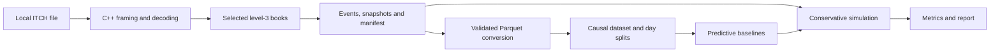

# ITCH-Lab

ITCH-Lab is an offline C++20/Python research platform for Nasdaq TotalView-ITCH 5.0 data. It
streams untrusted full-day files, reconstructs selected instruments' visible level-3 books, builds
causal research datasets, evaluates transparent predictive baselines and runs conservative
historical market-making simulations.

The project is designed for systems and quantitative-research review. It is not a live-trading
system, a matching-engine replica, financial advice or evidence that a strategy would be
profitable in live markets.

## Capabilities

- Bounded gzip/uncompressed ITCH framing with explicit endian decoding and checked input bounds.
- Typed support for S, R, H, A, F, E, C, X, D, U, P, Q and B messages, plus validated handling of
  spec-known non-book types.
- Deterministic selected-symbol level-3 reconstruction, aggregated top-N depth and canonical state
  digests.
- Versioned event/snapshot interchange files, immutable manifests and streamed deep validation.
- Typed, partitioned Parquet conversion with authenticated parent/child lineage.
- Past-only microstructure features, separate future-label computation and chronological whole-day
  train/validation/test partitions.
- Prior, multinomial logistic-regression and histogram-gradient-boosting baselines with
  training-only preprocessing and validation-only selection.
- Queue-, latency-, cost- and inventory-aware historical simulation with checked integer cash
  accounting and explicit terminal liquidation.
- Deterministic Markdown/HTML reports with accessible static SVG plots and relative reproduction
  commands.

## Pipeline



The C++ and Python layers communicate only through documented, versioned files. Replay is
single-threaded by default so source order and state digests remain deterministic; independent days
can be processed by separate commands.

## Official-data study

The published study evaluates AAPL, MSFT and AMZN across three chronological Nasdaq sample days:
2019-07-30 for training, 2019-10-30 for validation and 2019-12-30 for the one-shot test partition.
Strict inspection decoded 844,963,543 wire messages with zero parse errors, and deep validation
authenticated 14,455,244 replay event/snapshot records.

Histogram gradient boosting achieved the lowest validation log loss. Eleven of the twelve held-out
strategy/scenario cells had negative marked P&L, and every cell showed unfavourable 100 ms adverse
selection. The complete favourable and unfavourable outcomes are retained in the
[study evidence](docs/studies/TASK-031/EVIDENCE.md) and generated
[research report](docs/studies/TASK-031/report/report.md). These are conditional historical results,
not a live-profitability claim.

Official source files and bulk derived outputs are not distributed. Reproduction requires
separately authorised files matching the recorded basenames, sizes and SHA-256 values.

## Build and install

Prerequisites:

- macOS 13+ on Apple Silicon or a current x86-64 Linux distribution.
- CMake 3.25+, a C++20 compiler and zlib development headers.
- Python 3.11+ and Git.

From the repository root:

```sh
cmake --preset dev
cmake --build --preset dev

python3 -m venv .venv
source .venv/bin/activate
python -m pip install --require-hashes -r python/requirements-dev.lock
python -m pip install --no-build-isolation --no-deps -e ./python

./build/dev/itchlab --version
python -m itchlab_research --version
python -m itchlab_research doctor --binary ./build/dev/itchlab
```

CMake fetches the pinned C++ source dependencies while configuring; the application itself makes
no runtime network requests. The Python lock files contain fully resolved hashes.

## Synthetic quick start

The committed fixtures are synthetic and require no market-data licence. This small replay exercises
inspection, immutable publication and deep validation:

```sh
./build/dev/itchlab inspect \
  --input tests/fixtures/synthetic_minimal.itch \
  --all \
  --symbols AAPL

./build/dev/itchlab replay \
  --config configs/replay.diagnostic.example.json \
  --output-root runs/quickstart

./build/dev/itchlab validate \
  --run runs/quickstart/replay/<replay-id> \
  --verify-source tests/fixtures/synthetic_minimal.itch \
  --deep
```

The replay result prints the generated `<replay-id>`. A successful run contains `events.ilb`,
`snapshots.ilb` and `replay-manifest.json`; failed or cancelled work retains only a `.partial`
staging directory.

For the full research pipeline, update the safe relative manifest locators in the example configs,
then run:

```sh
python -m itchlab_research convert --config configs/conversion.example.json
python -m itchlab_research build-dataset --config configs/dataset.example.json
python -m itchlab_research train --config configs/experiment.example.json
python -m itchlab_research simulate --config configs/simulation.example.json
python -m itchlab_research report --run-id <simulation-id> --output-format both
```

The example conversion/dataset/experiment/simulation locators are placeholders for completed parent
runs; they are not silently replaced or downloaded.

## Validation and reproducibility

Every completed stage binds its effective config, parent hashes, tool identity, schema and child
hashes into an immutable manifest. Publication uses a run-owned partial directory followed by a
same-filesystem atomic rename. Downstream commands revalidate completed parents before reading
their data.

Research-integrity controls include:

- features may use only information available at or before their decision index;
- labels are computed separately and joined by immutable day/symbol/message identity;
- complete days, not random rows, form chronological partitions;
- preprocessing and calibration fit on training data only;
- model family and signal weight are selected on validation data only;
- test data is opened only after selection is frozen;
- passive fills require eligible observed execution flow after exact known queue ahead is depleted.

The release benchmark recorded a 9.71 million messages/second parser-plus-book median on the pinned
synthetic fixture, with an unchanged canonical book digest. The host ran x86-64 under Rosetta on an
Apple M2 Pro, so the result is not presented as native ARM64 performance. See the
[performance evidence](docs/performance/TASK-029-performance.md) for the complete method and
PERF-001–008 results.

## Important limitations

- ITCH exposes Nasdaq-visible activity only; hidden liquidity and other venues are unobserved.
- Historical data cannot reveal market impact or how participants would respond to a hypothetical
  order.
- The simulator is deliberately conservative and does not reproduce Nasdaq's matching engine.
- The official study has one day per partition, which is enough to demonstrate the method but not
  to establish deployable alpha or a stable trading edge.
- Full-day sources can be several gigabytes and remain user-managed local data.
- The MVP has no live receiver, broker/exchange connectivity, database, web service or telemetry.

The precise scientific and simulation assumptions are fixed in the
[product requirements](docs/01-product-requirements.md) and
[conservative simulation ADR](docs/decisions/ADR-004-conservative-simulation-policy.md).

## Quality and release checks

GitHub Actions validates the project on Ubuntu x86-64 and macOS ARM64, including native builds,
tests and the installed offline workflow. Separate jobs cover documentation contracts, C++/Python
formatting and static analysis, tiered coverage, sanitizers, fuzzing, dependency/secret checks and
the release performance floor.

Common local checks are:

```sh
ctest --preset dev
python -m pytest python/tests
python -m ruff check python
python -m ruff format --check python
python -m mypy python/src
python scripts/ci/check_docs.py
python scripts/ci/check_traceability.py
git diff --check
```

See the [testing strategy](docs/08-testing-strategy.md),
[security review](docs/07-security-and-privacy.md) and
[release process](docs/09-deployment.md) for the complete gates.

## Documentation

- [Project overview](docs/00-project-overview.md)
- [Product requirements](docs/01-product-requirements.md)
- [System architecture](docs/03-system-architecture.md)
- [Data model](docs/04-data-model.md)
- [Module, command and file contracts](docs/05-api-contracts.md)
- [Feature catalogue](docs/12-feature-catalogue.md)
- [Requirements traceability](docs/11-traceability.md)
- [v0.1.0 verification record](docs/release/v0.1.0-review.md)
- [Accepted architecture decisions](docs/decisions/)
- [Consolidated specification](FULL_PROJECT_SPECIFICATION.md)

When documents conflict, accepted ADRs take precedence, followed by product requirements,
architecture/data/contracts, and then testing and implementation plans.

## Licence

ITCH-Lab is available under the [MIT Licence](LICENSE). Third-party components retain their own
terms, recorded in [THIRD_PARTY_NOTICES.md](THIRD_PARTY_NOTICES.md).
