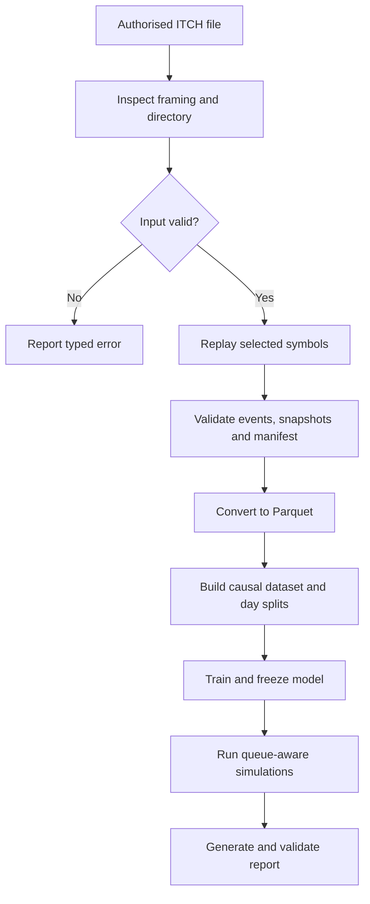
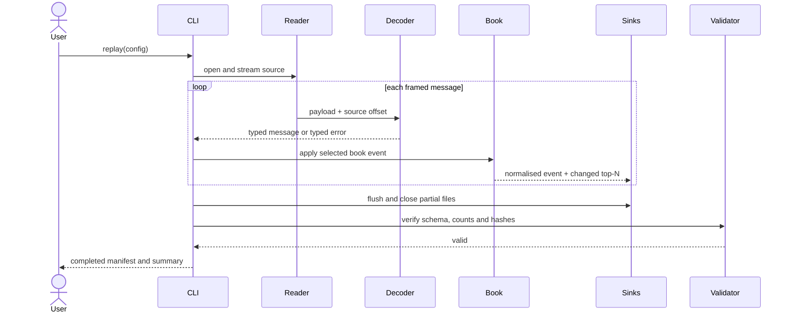
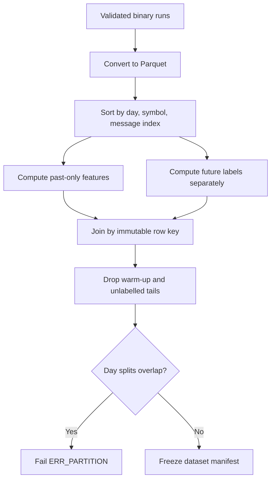
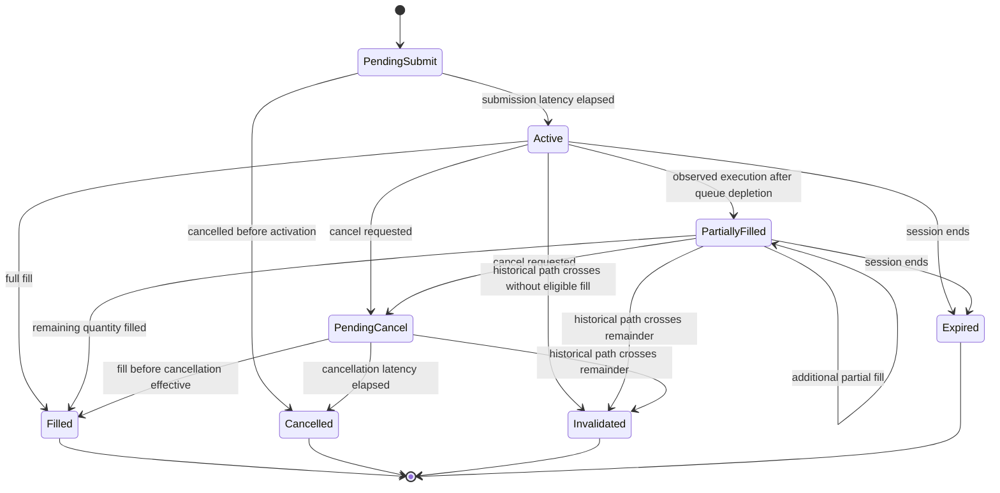

# 02 — User flows

## Flow inventory

| Flow | Persona | Outcome |
| --- | --- | --- |
| UF-001 | Developer | Inspect and qualify an input file |
| UF-002 | Developer/researcher | Replay selected symbols into validated normalised artefacts |
| UF-003 | Researcher | Convert data, build causal features and freeze partitions |
| UF-004 | Researcher/reviewer | Train baselines and review untouched test results |
| UF-005 | Researcher | Run strategy simulation and sensitivity analysis |
| UF-006 | Any | Cancel and recover from a long-running command |
| UF-007 | Reviewer | Reproduce and validate a published run |

## End-to-end workflow

## UF-001 — Inspect an input file

### Entry conditions

- A readable local ITCH file exists.
- Its trading date is known or can be supplied by the user.
- No output directory is required.

### Main path

1. The user runs itchlab inspect with an input path.
2. The command opens the file without following application-level redirects or downloading data.
3. It detects gzip or uncompressed input.
4. It validates the outer length framing on a bounded sample.
5. It decodes system and stock-directory messages.
6. It counts encountered message types and parse errors until the configured limit or end of file.
7. It prints a human summary or JSON result and exits 0.

### Alternative paths

- A symbol filter limits detailed statistics after the symbol is resolved.
- A no-limit flag inspects the complete file but still creates no derived data.
- Permissive mode counts safely framed unknown types.

### Failure and recovery

- Unreadable path: fail with ERR_INPUT_PATH; user corrects path/permissions.
- Unsupported compression: fail with ERR_UNSUPPORTED_COMPRESSION.
- Invalid first frame: fail with ERR_FRAMING; user verifies the source.
- Requested symbol absent: return ERR_UNKNOWN_SYMBOL after directory processing.

## UF-002 — Replay selected symbols

### Entry conditions

- UF-001 has succeeded for the source.
- Replay config passes JSON Schema validation.
- Output destination has sufficient free space according to a conservative estimate.

### Main path

1. The user runs itchlab replay with a version-controlled config.
2. The application canonicalises the config and computes its hash.
3. It computes or verifies the input SHA-256.
4. It creates a unique temporary run directory.
5. System and directory messages establish market/session and symbol-locate mappings.
6. The replay engine filters selected instruments while preserving source message order.
7. Typed order messages mutate the level-3 book.
8. Invariant checks run at the configured cadence.
9. The event sink writes normalised lifecycle records.
10. The snapshot sink writes only exported top-N changes and configured trades.
11. Writers flush, final counts/hashes are calculated, and validate runs.
12. If validation succeeds, temporary artefacts are atomically published and the manifest becomes completed.

### Alternative paths

- In permissive mode, a safely framed unknown type, known-type length mismatch, invalid timestamp
  or decoder field invariant may be skipped because the outer frame supplies the next boundary.
  An order-reference or quantity rejection may also be skipped because book mutation is atomic.
- Every observed error is counted by stable code. Each skip consumes one unit of the configured
  budget and marks the run degraded; the first error beyond the budget stops replay.
- A non-book trade may create an event record without a changed book snapshot.
- A selected symbol halted during part of the session retains state, but research rows outside a tradable state are flagged or excluded.

### Failure paths

- Duplicate/missing order reference: strict mode aborts with event context; permissive mode may
  skip the unchanged atomic mutation within budget.
- Error budget exceeded: abort, mark failed and retain partial diagnostics.
- Outer framing, I/O, internal and post-replay invariant failures are never skipped.
- Disk write/hash failure: abort without publishing final paths.
- Validation mismatch: preserve partial artefacts for diagnosis and exit non-zero.

### Cancellation

SIGINT follows UF-006. No completed artefact or completed manifest is published. Version 1 reports
cancelled status through the CLI envelope and retains the run-owned `.partial` staging directory.

## UF-003 — Convert and build a dataset

### Entry conditions

- At least three completed, non-degraded replay runs exist for distinct days.
- Each run passes artefact validation.
- Dataset config declares symbols, features, label horizons and day partitions.

### Main path

1. The user runs the convert command for each replay run.
2. The reader checks binary schema version and run-manifest hashes.
3. Events and snapshots are converted to typed Parquet tables through temporary files.
4. The user runs build-dataset with a canonical config.
5. Rows are ordered by day, symbol and message index.
6. Causal rolling features are generated using current and past rows only.
7. Future mid-price labels are generated separately.
8. Warm-up and unlabelled tail rows are counted and removed.
9. Complete days are assigned to train, validation and test partitions.
10. Dataset statistics, feature definitions and content hashes are written to a dataset manifest.

### Failure and recovery

- Unsupported schema: use a matching converter or an explicit migration.
- Missing replay day: correct config; the tool never silently substitutes a day.
- Non-monotonic indices: reject source run and revalidate/replay it.
- Empty class after filtering: reject the dataset or revise the documented horizon/symbol set.

## UF-004 — Train and evaluate predictive baselines

### Entry conditions

- A frozen dataset manifest exists.
- Train, validation and test partitions are non-empty.
- Experiment config declares preprocessing, models, seeds and selection metric.

### Main path

1. Fit imputers/scalers on training rows only.
2. Fit the prior/majority baseline.
3. Fit multinomial logistic regression.
4. Fit histogram gradient boosting.
5. Evaluate candidate settings on validation days.
6. Select one setting per declared rule and freeze it.
7. Evaluate the selected models once on the test partition.
8. Write metrics, predictions, calibration data, confusion matrices and model metadata.
9. Generate a report section including unfavourable results and class distribution.

### Alternative paths

- If a model cannot train, record failure; do not silently remove it from comparison.
- With fewer than five trading days, omit day-block confidence intervals and state why.

### Prohibited path

Changing features, horizons, hyperparameters or selection rules after viewing test performance requires a new experiment family and a prominently disclosed exploratory status.

## UF-005 — Simulate strategies

### Entry conditions

- Market events, snapshots and a frozen model/prediction stream exist.
- Simulation config declares decision cadence, latency, order size, costs, risk limits, queue policy and terminal liquidation.

### Main path

1. Replay the test-day market events in order.
2. At each decision point, the strategy uses the latest same-symbol prediction at or before the current message, records its exact key, and emits desired bid/ask actions.
3. Actions enter pending state until submission latency elapses.
4. Active passive orders join behind the visible queue at their price; actions effective at the same timestamp as source events are applied after all those source events.
5. Subsequent known lifecycle events update queue ahead.
6. Executions that exhaust queue ahead partially or fully fill the simulated order.
7. Inventory, cash, fees and marked P&L update after each fill.
8. Cancellation requests remain exposed until cancellation latency elapses.
9. Inventory limits suppress risk-increasing orders.
10. At session end, open orders expire and inventory is liquidated by the documented rule.
11. Results are aggregated by day and across latency/cost scenarios.

### Alternative and failure paths

- A marketable desired quote is rejected by the passive-only MVP rather than assumed to fill.
- Missing/corrupt prediction at a decision point falls back to zero signal and records a diagnostic.
- An inconsistent queue event skips the affected simulated action; exceeding the anomaly budget aborts the scenario.
- If volatility/intensity calibration is unavailable, the strategy does not use a future window; it either uses a declared prior or skips quoting.

## UF-006 — Cancel and recover

### Main path

1. User sends SIGINT.
2. The signal handler sets an atomic cancellation flag; it performs no unsafe I/O.
3. The main loop observes the flag at a message boundary.
4. Writers flush and close their partial files.
5. The CLI result records cancelled status; the completed-only version-1 manifest remains absent.
6. The command exits with code 130.

### Recovery

- The user may inspect logs and partial metadata.
- The user may archive/remove the partial run or select a fresh output root before rerunning; a
  conflicting partial identity is never overwritten automatically.
- Automatic continuation from a byte offset is deferred because restoring complete order-book state is not implemented.
- Partial artefacts are never accepted as completed inputs.

## UF-007 — Reproduce and validate a published run

### Entry conditions

- The reviewer has the repository revision, configs, report/run manifest and authorised source files matching the recorded hashes.

### Main path

1. Build using the documented release preset.
2. Run itchlab validate against source and published replay manifests.
3. Replay or reuse locally validated derived artefacts.
4. Rebuild the dataset using the recorded config.
5. Re-run training and simulation with recorded seeds.
6. Regenerate the report.
7. Compare deterministic hashes and numeric metrics using declared tolerances.

### Failure and recovery

- Source hash mismatch: obtain the correct authorised input; do not override silently.
- Code revision unavailable: mark reproduction incomplete.
- Floating-point metric outside tolerance: retain both results and investigate platform/library differences.
- Plot pixels may differ by renderer; underlying plotted data must match.
