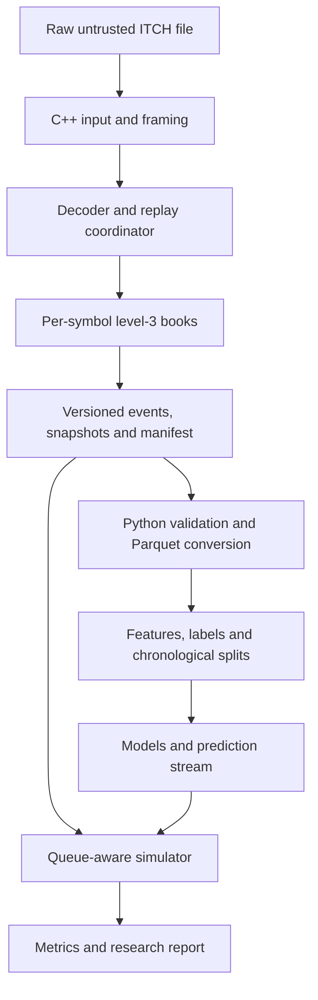
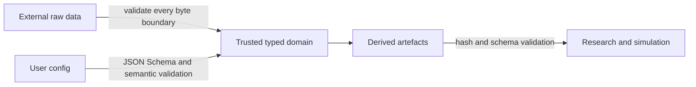
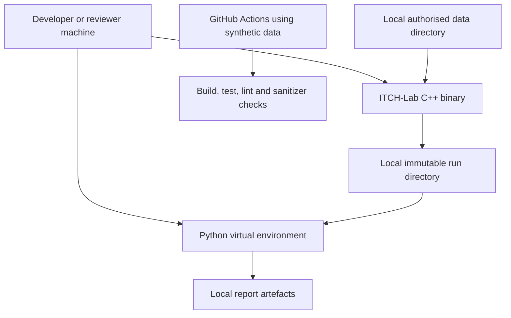

# 03 — System architecture

## Chosen architecture

ITCH-Lab is a local, file-oriented pipeline with two implementation layers:

1. A single-process C++20 performance core streams framed ITCH messages, decodes typed payloads, reconstructs selected level-3 books and writes versioned normalised artefacts.
2. A Python package validates and converts those artefacts, creates research datasets, trains baselines, performs historical simulation and generates reports.

The layers communicate through documented immutable files rather than an in-process language binding or network service.

**Classification:** the C++/Python split and offline pipeline are confirmed requirements; the precise file-oriented boundary is a recommendation accepted in ADR-001 and ADR-002.

## Architecture rationale

- Parsing and book maintenance are naturally stateful, branch-heavy and performance-sensitive; C++ exposes data-structure and profiling decisions.
- Research changes more frequently and benefits from Python's numerical and tabular ecosystem.
- An explicit file boundary keeps experiment inputs reproducible, lets either layer be tested independently and avoids per-message Python-call overhead.
- A single-threaded replay is easier to make deterministic and correct. Independent source days can be processed as separate operating-system processes if needed.
- No database, service mesh, queue or cloud platform is needed for the MVP.

## Architecture diagram

## Technology choices

| Concern | Choice | Rationale |
| --- | --- | --- |
| Language standard | C++20 | Relevant systems signal; spans, variants and stronger type support |
| Build | CMake with checked-in presets | Works on macOS/Linux and supports reproducible dev/release/sanitizer builds |
| Compression | zlib-compatible streaming adapter | Official samples are gzip; avoids full decompression |
| CLI parsing | Small project-owned C++20 adapter (ADR-006) | Current command surface is bounded; avoids an unnecessary dependency while keeping domain modules independent of argv/output |
| Config/manifest | nlohmann/json plus JSON Schema validation at command boundary | One readable, canonical cross-language representation |
| C++ tests | Catch2 | Unit and integration test ergonomics |
| Microbenchmarks | Google Benchmark | Repeatable benchmark harness and counters |
| Python packaging | pyproject.toml, src layout | Modern isolated package and test imports |
| Tabular engine | PyArrow/Parquet with bounded Python state | Typed columnar batches without pandas object fallbacks; Polars remains optional until a measured later-stage need |
| Baseline models | scikit-learn | Transparent, established baselines |
| Reporting | Markdown plus optional static HTML and PNG/SVG plots | Reviewable in Git and usable offline |

CMake uses find_package(ZLIB REQUIRED) for the platform zlib and FetchContent with immutable pinned
revisions for nlohmann/json, Catch2 and, when TASK-029 adds benchmarks, Google Benchmark. Python
direct dependencies live in pyproject.toml and fully resolved hashed development/release
requirements files are generated with pip-tools. Application runtime performs no dependency
download.

## Rejected alternatives

| Alternative | Why rejected for MVP | Revisit when |
| --- | --- | --- |
| Python-only parser/book | Weaker systems signal and likely poorer full-day throughput | A correctness oracle or rapid prototype is useful |
| pybind11 per-event interface | Cross-language calls complicate ownership and harm throughput | Batched zero-copy API has a concrete consumer |
| Apache Arrow C++ writer | Heavy build/dependency surface for initial milestones | Custom interchange becomes a maintenance bottleneck |
| CSV between layers | Large, slow and weakly typed; integer/null semantics are fragile | Small diagnostic export only |
| SQLite/Postgres | No transactional multi-user query need; adds ingestion and schema machinery | Interactive multi-run catalogue is required |
| Multi-threaded per-symbol replay | Increases ordering, back-pressure and determinism complexity | Single-thread profile proves CPU-bound and target is missed |
| Web API/frontend | No remote or multi-user product requirement | A reviewer genuinely needs interactive exploration |
| Live market receiver | Operational, legal and networking scope dwarfs portfolio value | Offline correctness and research are complete |

## Major C++ components

### ByteSource

Responsibilities:

- Expose bounded sequential reads from uncompressed or gzip input.
- Track compressed/uncompressed byte counts where available.
- Never allocate based directly on an unchecked source length.

Implementations: FileByteSource and GzipByteSource.

### FramedMessageReader

Responsibilities:

- Read the two-byte big-endian outer length.
- Reject zero, truncated or over-limit frames; the MVP hard limit is 512 payload bytes.
- Return an immutable payload span and zero-based offset in the uncompressed framed stream.
- Assign the monotonic project message index.

ADR-005 fixes this as project framing `itch-length-v1` after verification against the public
Nasdaq 2019-12-30 TotalView-ITCH 5.0 sample. A complete payload followed by physical EOF is clean;
zero length remains invalid despite the older BinaryFILE terminator wording.

### ItchDecoder

Responsibilities:

- Verify exact length for every known type before accessing fields.
- Decode big-endian integers and six-byte timestamps explicitly.
- Return a closed variant of typed domain messages.
- Return stable DecodeError values without throwing for ordinary bad input.

### InstrumentDirectory

Responsibilities:

- Map daily stock-locate codes to symbols and metadata.
- Resolve configured symbols.
- Reject contradictory directory records.
- Avoid assuming locate codes persist across days.

### SessionState

Responsibilities:

- Retain valid global `S` events in source order for later manifest publication.
- Track `H`, `P`, `Q` and `T` states independently for each selected daily stock locate.
- Treat a selected instrument not declared trading by the pre-opening `H` spin as halted once the
  start-of-system-hours `S` event arrives.
- Close selected instruments at the end-of-market-hours `M` event and expose an exact tradable
  predicate to snapshot filtering.

### ReplayCoordinator

Responsibilities:

- Apply global/session messages.
- Route selected instrument messages in source order.
- Invoke strict/permissive policy.
- Coordinate books, sinks, progress and cancellation.

### OrderBook

Recommended correctness-first representation:

- An unordered map from order reference to an OrderRecord.
- Ordered bid/ask maps from Price4 to PriceLevel.
- Each PriceLevel stores total quantity and a FIFO list of order references.
- OrderRecord stores a stable iterator into its level queue for O(1) removal.

The public book interface owns all mutation invariants; writers and strategies cannot alter state directly.

### InvariantChecker

Checks include:

- Every live order occurs exactly once in its side/price queue.
- Level total equals summed remaining order quantity.
- No zero-quantity live order or empty stored price level.
- Order side/price matches its owning level.
- Best bid is below best ask during normal continuous trading when both exist.
- Counts and quantity arithmetic do not overflow.

### NormalisedEventSink and SnapshotSink

Responsibilities:

- Write explicit little-endian fields rather than packed host structs.
- Write to partial paths.
- Maintain running record counts and SHA-256.
- Reject unsupported schema/config changes mid-stream.
- Publish only after validation.

### ManifestBuilder and ArtefactValidator

Responsibilities:

- Record lineage, configuration, versions, counts, hashes and status.
- Validate output headers, record sizes/counts and cross-file identities.
- Ensure a completed manifest is the final publication action.

### CLI application

Subcommands: inspect, replay, validate and benchmark. Detailed contracts are in 05-api-contracts.md.

## Major Python components

| Component | Responsibility |
| --- | --- |
| interchange | Safe readers for supported event/snapshot schemas; no pickle |
| conversion | Authenticated bounded conversion to typed Parquet and an atomic conversion manifest |
| features | Bounded past-only event/snapshot calculations and deterministic feature metadata |
| labels | Future-horizon labels in a separate computation stage |
| splits | Whole-day chronological partitions and leakage assertions |
| models | Prior, logistic and gradient-boosting baselines |
| metrics | Predictive calibration/classification and day-block aggregation |
| simulator | Simulated order lifecycle, queue, latency, fills, cash/inventory |
| strategies | Inventory-aware baseline and bounded signal adjustment |
| reporting | Markdown/HTML report, plots and reproduction commands |
| cli | convert, build-dataset, train, simulate and report commands |

## Communication and file contracts

- Raw input is never modified.
- C++ produces a replay manifest, normalised event file and snapshot file.
- Python validates the manifest and converts both binary files to Parquet.
- A dataset manifest binds converted inputs, feature config, label config and partitions.
- An experiment manifest binds the dataset, preprocessing, model settings, seeds and metrics.
- A simulation manifest binds event data, predictions, strategy and execution assumptions.
- The Python simulation service authenticates conversion Parquet and lineage, calibrates only on
  training days, selects only on validation days, runs frozen test scenarios through the existing
  simulator/strategy domains and publishes the manifest last. No new network or per-event
  cross-language boundary is introduced.
- The final report links those identities rather than copying unverifiable numbers.

Canonical JSON and stage identities follow the exact scheme in 04-data-model.md; paths and wall-clock metadata are deliberately excluded.

File schemas and module interfaces are specified in 04-data-model.md and 05-api-contracts.md.

## Trust boundaries

1. Raw ITCH bytes are untrusted even when obtained from an official source.
2. Local config is untrusted at the command boundary.
3. Binary/Parquet derived files are trusted only after matching a completed manifest.
4. Model and report outputs are not executable inputs.
5. No network trust boundary exists in the MVP.

## External dependencies

- Nasdaq ITCH 5.0 format specification and user-obtained sample data.
- C++ standard library, zlib and nlohmann/json; Catch2 is test-only. Google Benchmark remains
  planned for TASK-029 and is not yet fetched.
- Python, JSON Schema, RFC 8785, NumPy, PyArrow and scikit-learn plus their locked transitive
  dependencies. Reports use project-owned static SVG rendering; Polars and Matplotlib are not
  installed dependencies.
- Git and GitHub Actions for versioning/CI.

Dependencies must be pinned or constrained, licence-reviewed and scanned in CI. The application performs no runtime dependency download.

## Data flow

1. Input bytes are streamed and framed.
2. Payloads become typed messages only after length validation.
3. Directory messages establish daily symbol identity.
4. Selected pre-session and in-session order messages mutate the owning level-3 book; event records mark which messages are in session.
5. Normalised events are serialised for warm-up through session end, while snapshots are limited to the configured session.
6. Artefacts are hashed, validated and atomically published.
7. Python converts validated records in chunks.
8. Feature and label stages write separate columns before a controlled join; feature state consumes
   only events at or before each decision message index.
9. Models emit predictions keyed by immutable day/symbol/message index.
10. Simulator joins predictions only at matching or earlier decision indices.
11. Metrics and reports read immutable run manifests.

## State management

- C++ replay state is in-memory and scoped to one source day.
- Each instrument owns its book; order references are additionally checked for source-day uniqueness.
- No replay checkpoint/resume state is stored.
- Python stages are pure transformations where practical and publish immutable run directories.
- Wall-clock progress state is not included in deterministic output hashes.
- Randomness is permitted only in declared research/bootstrap operations and uses recorded seeds.

## Error-handling strategy

- Expected domain failures return typed result/error values.
- Programmer invariant failures throw or terminate tests; production commands translate them to ERR_INTERNAL with diagnostics.
- No exception crosses the top-level CLI boundary.
- Strict mode is the default for publishable outputs.
- Permissive output is marked degraded and rejected downstream unless explicitly allowed.
- Partial files never share the final filename.
- Error logs include message index, timestamp when decoded, source offset, type and identifiers; raw bytes are included only in explicit local debug output with a small cap.

## Logging and observability

- Human logs go to stderr; machine-readable results go to stdout.
- Levels: debug, info, warning and error.
- JSON-lines logging is available for automated runs.
- Each line includes command, run ID where known and stable event/error code.
- Progress is rate-limited; per-message logging is prohibited outside bounded debugging.
- Final summaries include throughput, selected-event counts, errors, warnings, output paths and hashes.
- No telemetry or network logging exists.

## Performance considerations

- Use fixed-width integer domain types and avoid floating point in the replay path.
- Filter by stock-locate code immediately after safe access to the common field.
- Reuse bounded input buffers and reserve expected containers after measurement.
- Avoid constructing symbol strings per message.
- Keep correctness-first ordered price maps for MVP; benchmark before replacing them.
- Compile benchmarks in release mode without per-event invariant scans.
- Separate parser-only, parser-plus-filter and parser-plus-book benchmarks.
- Profile decompression independently from uncompressed parsing.
- Preserve a deterministic final state digest across optimisations.

## Scalability considerations

The MVP scales vertically through streaming and symbol filtering. It intentionally processes a single source sequentially because message order defines state. Separate trading days can be processed independently by separate commands. If profiles show a need, later work may parallelise decompression/framing and downstream symbol partitions using ordered queues, but only with deterministic equivalence tests and an ADR.

## Deployment architecture

There is no production server. “Deployment” means a versioned local release archive and reproducible environment instructions.

## Proposed source-code directory structure

    cpp/
    ├── apps/itchlab/
    │   ├── main.cpp
    │   └── commands/
    ├── include/itchlab/
    │   ├── core/types.hpp
    │   ├── input/byte_source.hpp
    │   ├── input/framed_reader.hpp
    │   ├── itch/messages.hpp
    │   ├── itch/decoder.hpp
    │   ├── book/order_book.hpp
    │   ├── replay/replay_engine.hpp
    │   ├── output/event_writer.hpp
    │   ├── output/snapshot_writer.hpp
    │   ├── output/manifest.hpp
    │   └── validation/validator.hpp
    └── src/
        └── mirrors public module boundaries

    python/
    ├── pyproject.toml
    └── src/itchlab_research/
        ├── cli.py
        ├── config.py
        ├── interchange/
        ├── conversion/
        ├── datasets/
        ├── models/
        ├── simulation/
        ├── strategies/
        ├── metrics/
        └── reporting/

    tests/
    ├── cpp/unit/
    ├── cpp/integration/
    ├── cpp/fuzz/
    ├── fixtures/
    └── golden/

    schemas/
    ├── replay-config.schema.json
    ├── replay-manifest.schema.json
    ├── conversion-config.schema.json
    ├── conversion-manifest.schema.json
    ├── dataset-config.schema.json
    ├── dataset-manifest.schema.json
    ├── experiment-config.schema.json
    └── simulation-config.schema.json
