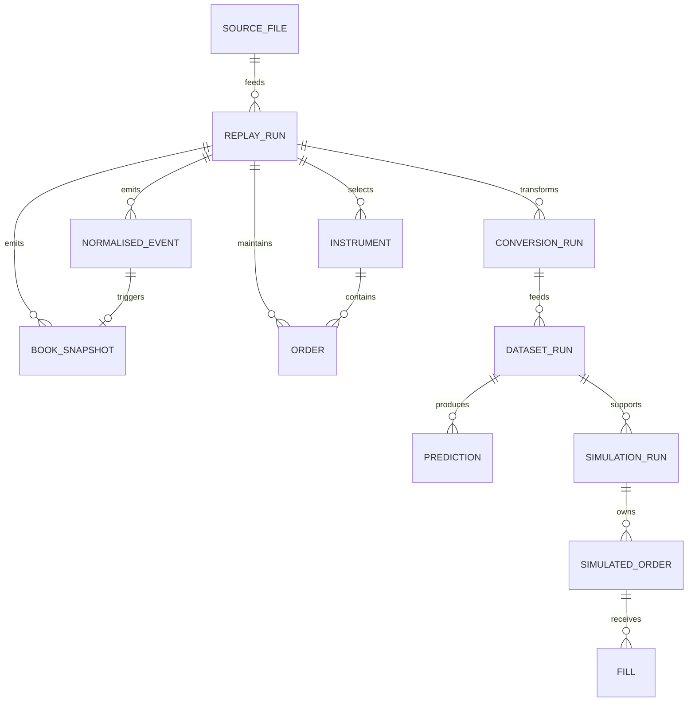

# 04 — Data model

## Model principles

- No relational database is used in the MVP.
- Raw, interchange, analytical and result artefacts are immutable once completed.
- Prices remain scaled integers until presentation.
- Trading date, symbol and message index form the stable event identity.
- Nullability is explicit in Parquet and JSON; binary records use validity flags.
- Every derived artefact points to a completed parent manifest and content hash.

## Canonical hashing and identities

- Canonical JSON bytes follow [RFC 8785 JSON Canonicalization Scheme](https://www.rfc-editor.org/rfc/rfc8785.html), encoded as UTF-8. Duplicate object names, invalid Unicode, NaN and infinity are rejected before hashing. Implementations do not invent a separate C++/Python float formatting rule.
- The effective config is the validated version-1 config after documented defaults have been materialised. `config_sha256` is SHA-256 over the complete canonical effective config, including relative locator fields, and is the integrity fingerprint stored with the config.
- For replay publication, a null `input.sha256` is materialised to the verified source hash and
  `input.path` is reduced to the source basename before the effective config is stored or hashed.
  This keeps first-run and expected-hash replay bytes consistent while preventing absolute local
  paths from entering a publishable manifest.
- An identity-config projection removes only locator fields whose identified parent content is already supplied separately: replay `input.path` and `input.sha256`; conversion `replay_manifests` and `output_root`; dataset `conversion_manifests`; experiment `dataset_manifest`; and simulation `dataset_manifest` and `prediction_manifest`. No scientific, validation or selection field is removed. `identity_config_sha256` is SHA-256 over that canonical projection.
- A stage identity digest is SHA-256 over: an ASCII domain separator ending in NUL; ordered raw 32-byte parent-content hashes; the raw 32-byte identity-config hash; the exact executable or installed-wheel 32-byte content hash; and the output schema version as an unsigned two-byte big-endian integer.
- Replay uses domain separator itchlab-replay-v1; later stages use itchlab-conversion-v1, itchlab-dataset-v1, itchlab-experiment-v1 and itchlab-simulation-v1.
- Human run IDs are a UTC basic timestamp with nine fractional-second digits, a hyphen and the
  first 12 lowercase hexadecimal digest characters, for example
  `20260807T120000.123456789Z-a1b2c3d4e5f6`. The full digest remains in the manifest. Fractional
  precision permits `--force-new-run` to create a distinct immutable run without changing the
  scientific identity.
- A publishable run requires a Release build from a clean recorded Git commit. Debug builds and
  development runs from dirty trees are labelled non-publishable; their recorded build metadata
  distinguishes them from the corresponding clean Release build. Repeating the same development
  build still follows normal idempotent reuse unless `--force-new-run` requests another immutable
  timestamped directory.
- Observational start/end times, locator paths and progress metrics do not enter the stage-identity digest. They remain covered by the full config or manifest integrity hash where present.
- RFC 8785 uses the I-JSON number model. JSON integer fields therefore use the interoperable exact range −(2^53−1) through 2^53−1 even when their in-memory domain type is wider. In particular, version-1 numeric random seeds are restricted to 0 through 2^53−1 while remaining `uint64` in memory and manifests.

## Conceptual relationships

Order and PriceLevel are transient domain entities. Other entities are persisted as manifests, binary records or Parquet rows.

## Primitive domain types

| Type | Storage | Rule |
| --- | --- | --- |
| MessageIndex | uint64 | Monotonic within one source file, starts at 0 |
| TimestampNs | uint64 | Nanoseconds since exchange-local midnight; less than 86,400,000,000,000 |
| StockLocate | uint16 | Daily identifier; 0 is global/not instrument-specific |
| SymbolId | uint16 | Project-local identifier within one replay output |
| OrderReference | uint64 | Unique for a live order; source-day semantics |
| MatchNumber | uint64 | Source-day trade/execution identifier |
| Price4 | uint32 | Four implied decimal places; no floating arithmetic in core |
| Shares | uint64 persisted | Positive for quantities; C++ validates narrower source fields before widening |
| Microusd | int64 | Cash, fees and P&L; every arithmetic operation is overflow checked |
| RandomSeed | uint64 | JSON v1 accepts 0 through 2^53−1 for RFC 8785/I-JSON interoperability |
| Side | int8 | +1 buy, -1 sell, 0 not applicable |
| TradingDate | ISO date/uint32 | JSON uses YYYY-MM-DD; binary header uses YYYYMMDD |
| ContentHash | string/bytes32 | SHA-256; lowercase hexadecimal in JSON |

## Persisted entities

### SourceFile

Stored inside a replay manifest.

| Field | Type | Nullable | Default | Constraints/owner |
| --- | --- | --- | --- | --- |
| canonical_name | string | No | — | Manifest builder; basename only in publishable output |
| sha256 | 64-char hex | No | — | Computed before or during replay |
| size_bytes | uint64 | No | — | Filesystem |
| compression | enum | No | detected | gzip or none |
| framing | string | No | itch-length-v1 | ADR-005; positive two-byte big-endian length and complete-frame EOF |
| trading_date | ISO date | No | — | Required config; not silently inferred |
| exchange_timezone | string | No | America/New_York | Fixed IANA zone for Nasdaq MVP |

### Instrument

Persisted in replay manifest and binary symbol dictionary.

| Field | Type | Nullable | Default | Constraints/owner |
| --- | --- | --- | --- | --- |
| symbol_id | uint16 | No | — | Unique per replay; assigned deterministically by requested-symbol order |
| stock_locate | uint16 | No | — | Unique for active directory record in source day |
| symbol | ASCII string | No | — | Trimmed Stock field, 1–8 bytes |
| market_category | char | Yes | null | From Stock Directory if retained |
| financial_status | char | Yes | null | From Stock Directory if retained |
| round_lot_size | uint32 | No | — | From Stock Directory |
| round_lots_only | bool | No | false | From Stock Directory |

Uniqueness constraints: (replay_id, symbol_id), (replay_id, stock_locate), and (replay_id, symbol).

### ReplayRun

One directory with replay-manifest.json, events.ilb and snapshots.ilb.

| Field | Type | Nullable | Default | Constraints/owner |
| --- | --- | --- | --- | --- |
| replay_id | string | No | generated | UTC timestamp plus 12-char identity-hash prefix |
| status | enum | No | — | Published manifest is `completed` or `degraded` |
| schema_version | uint16 | No | 1 | Manifest schema |
| source | SourceFile | No | — | Exactly one source per replay |
| config | object | No | — | Canonical replay config |
| config_sha256 | hex | No | — | Hash of canonical config |
| code_revision | string | No | — | Git commit plus dirty flag |
| build | object | No | — | Compiler, version, target, build type |
| instruments | array | No | [] | At least one on completed non-empty replay |
| started_at | UTC timestamp | No | now | Observational, excluded from identity |
| completed_at | UTC timestamp | Yes | null | Required for terminal status |
| counts | object | No | zeroes | Source, decoded, selected, event, snapshot and error counts |
| artefacts | array | No | [] | Relative path, schema, size and SHA-256 |
| error_summary | object | No | {} | Counts by stable code |

Version 1 additionally records `identity_sha256`, `identity_config_sha256`,
`executable_sha256`, `publishable`, global session events, final per-instrument state/digest and
per-artefact record metadata. `publishable` is false unless the recorded build is a Release build
from a clean Git tree. Artefact paths are fixed run-relative basenames.
Failed or cancelled work remains beneath a `.partial` path and never receives a completed replay
manifest; its operational state is therefore not part of this published-manifest schema.

### NormalisedEvent

Persisted in events.ilb and later events.parquet.

| Field | Type | Nullable | Default | Validation |
| --- | --- | --- | --- | --- |
| trading_date | date | No | header | From completed replay |
| message_index | uint64 | No | — | Strictly increasing in output |
| timestamp_ns | uint64 | No | — | Non-decreasing for a clean source |
| symbol_id | uint16 | No | — | Must exist in symbol dictionary |
| event_kind | enum | No | — | add, execute, execute_price, cancel, delete, replace, trade, cross, broken_trade, trading_state |
| source_type | uint8/char | No | — | Original ITCH type |
| primary_reference | uint64 | Yes | null | Order reference or broken match according to kind |
| secondary_reference | uint64 | Yes | null | New order reference or match number |
| side | int8 | Yes | null | +1/-1 when defined; trade-side field is not treated as aggressor truth |
| price4 | uint32 | Yes | null | Display/new/trade price according to kind |
| execution_price4 | uint32 | Yes | null | Only execute-with-price |
| quantity | uint64 | Yes | null | Event quantity |
| remaining_quantity | uint64 | Yes | null | Remaining visible order shares after mutation |
| aux_code | fixed ASCII[4] | Yes | null | MPID attribution for attributed add; reason code for trading_state |
| event_subtype | uint8/char | Yes | null | Cross type for cross; trading-state code for trading_state |
| in_session | bool | No | false | True exactly when timestamp is in the configured half-open research session |
| flags | uint16 | No | 0 | Field-validity and in-session bits; unknown bits must be zero in v1 writer |

Primary key: (trading_date, message_index, symbol_id, event_kind). A message can yield at most one normalised event for the selected instrument in the MVP.

### BookSnapshot

Persisted in snapshots.ilb and snapshots.parquet.

| Field | Type | Nullable | Default | Validation |
| --- | --- | --- | --- | --- |
| trading_date | date | No | header | Replay trading date |
| message_index | uint64 | No | — | References triggering event |
| timestamp_ns | uint64 | No | — | Trigger time |
| symbol_id | uint16 | No | — | Dictionary member |
| event_kind | enum | No | — | Trigger classification |
| event_price4 | uint32 | Yes | null | When meaningful |
| event_quantity | uint64 | Yes | null | When meaningful |
| last_trade_price4 | uint32 | Yes | null | Latest selected P/Q trade observation |
| last_trade_quantity | uint64 | Yes | null | Paired with last trade price |
| top_n_changed | bool | No | false | True when this snapshot was emitted because exported depth changed |
| bid_price4_1..N | uint32 | Yes | null | Strictly descending valid levels |
| bid_quantity_1..N | uint64 | Yes | null | Positive when paired price valid |
| ask_price4_1..N | uint32 | Yes | null | Strictly ascending valid levels |
| ask_quantity_1..N | uint64 | Yes | null | Positive when paired price valid |
| trading_state | enum | No | unknown | preopen, trading, halted, paused, quotation_only, closed or unknown |

Uniqueness: (trading_date, symbol_id, message_index). Rows are physically sorted by symbol_id then message_index in Parquet partitions, while binary order follows source message order.

For snapshot-v1, P and Q are the configured unchanged-book trade observations. They update the
per-instrument last-trade pair even when unchanged trade snapshots are disabled, so a later
top-N/state snapshot carries the latest causal observation. B records do not rewrite an earlier
snapshot or rewind this pair.

### ConversionRun and Parquet schema v1

A conversion run is stored beneath `conversion/<conversion-id>/` and contains a completed
`conversion-manifest.json` plus separate event and snapshot datasets. It accepts one or more
completed replay manifests with unique trading dates and a common snapshot depth. Degraded replay
parents are rejected unless `allow_degraded` is explicitly true; accepting one makes the conversion
status `degraded`.

The manifest records the effective config and both config hashes, the full conversion identity,
the Python package-content hash and runtime versions, ordered authenticated parent identities,
logical schemas and their canonical hashes, per-partition counts, and every Parquet file's relative
path, row count, size and SHA-256. The conversion identity uses the ordered replay-manifest SHA-256
values as parent-content hashes and the `itchlab-conversion-v1` domain separator.

Dataset paths are fixed as follows, where the symbol component is URI percent-encoded so a source
symbol cannot introduce a path separator:

    events/trading_date=YYYY-MM-DD/symbol=<encoded-symbol>/part-N.parquet
    snapshots/trading_date=YYYY-MM-DD/symbol=<encoded-symbol>/part-N.parquet

`trading_date` and `symbol` are typed logical partition columns reconstructed from those paths; they
are omitted from each physical Parquet file. Rows are strictly increasing by `message_index` within
each `(kind, trading_date, symbol)` partition. Zstandard is the version-1 compression codec and the
configured `row_group_size` is an upper bound on rows in each row group.

The logical event schema is:

| Field | Arrow/Parquet dtype | Nullable |
| --- | --- | --- |
| trading_date | date32[day] | No |
| symbol | string/UTF-8 | No |
| message_index | uint64 | No |
| timestamp_ns | uint64 | No |
| symbol_id | uint16 | No |
| event_kind | string/UTF-8 | No |
| source_type | string/UTF-8 | No |
| primary_reference | uint64 | Yes |
| secondary_reference | uint64 | Yes |
| side | int8 | Yes |
| price4 | uint32 | Yes |
| quantity | uint64 | Yes |
| remaining_quantity | uint64 | Yes |
| execution_price4 | uint32 | Yes |
| aux_code | string/UTF-8 | Yes |
| event_subtype | string/UTF-8 | Yes |
| in_session | bool | No |
| flags | uint16 | No |

The logical snapshot schema is:

| Field | Arrow/Parquet dtype | Nullable |
| --- | --- | --- |
| trading_date | date32[day] | No |
| symbol | string/UTF-8 | No |
| message_index | uint64 | No |
| timestamp_ns | uint64 | No |
| symbol_id | uint16 | No |
| event_kind | string/UTF-8 | No |
| event_price4 | uint32 | Yes |
| event_quantity | uint64 | Yes |
| last_trade_price4 | uint32 | Yes |
| last_trade_quantity | uint64 | Yes |
| top_n_changed | bool | No |
| trading_state | string/UTF-8 | No |
| flags | uint8 | No |
| bid_price4_1..N | uint32 | Yes |
| bid_quantity_1..N | uint64 | Yes |
| ask_price4_1..N | uint32 | Yes |
| ask_quantity_1..N | uint64 | Yes |

Nullable columns preserve the binary validity flags exactly: a valid numeric zero remains zero and
an invalid field becomes Arrow null. Price4 and quantity fields remain integers; conversion does
not introduce floating-point prices.

### DatasetRun

Stored in dataset-manifest.json with Parquet artefacts.

| Field | Type | Nullable | Default | Constraints |
| --- | --- | --- | --- | --- |
| dataset_id | string | No | generated | Content-addressed identity |
| schema_version | uint16 | No | 1 | Dataset schema |
| parents | array[object] | No | — | Authenticated conversion IDs, hashes and covered days |
| config/config hashes | object/string | No | — | Canonical dataset config and full/identity hashes |
| tool | object | No | — | Package-content digest and runtime versions |
| partitions | object | No | — | Non-overlapping whole-day lists |
| feature_catalogue | object | No | — | Ordered names, dtypes, formulae, lookbacks and owners |
| labels | object | No | — | Horizons, int8 class map and tail policy |
| schema | object | No | — | Joined logical fields plus canonical schema hash |
| counts | object | No | — | Disjoint row drops, classes and label availability globally and by split/day/symbol |
| artefacts | array | No | — | Joined Parquet paths, partitions, rows, sizes and hashes |
| supporting_artefacts | array | No | — | Hashed feature catalogue and data-quality documents |
| status | enum | No | completed | Completed only after validation |

Version 1 physically partitions beneath `dataset/partition=<name>/trading_date=<date>/symbol=<encoded>`
and sorts each child by `message_index`. The three partition columns are reconstructed from the
Hive path and are present in the logical schema, not duplicated in each Parquet child. These are
physical pruning aids, not database indexes.

### FeatureRow and feature catalogue v1

TASK-018 computes one row for every qualifying snapshot before sampling. The row identity columns
are `trading_date` date32, `symbol` UTF-8, `symbol_id` uint16, `message_index` uint64,
`timestamp_ns` uint64 and zero-based `qualifying_ordinal` uint64. `history_complete` is a non-feature
boolean that is true only when every required event and clock lookback is complete. It lets the
dataset stage distinguish warm-up nulls from intentional semantic nulls such as absent observable
aggressor direction.

Every continuous feature uses Arrow float64; `aggressor_sign` uses nullable int8. Derived values
must be finite. The deterministic feature catalogue records, in output-column order, each feature's
name, dtype, nullability, formula, lookback kind/value, units, null policy and owning module. The
exact version-1 names and definitions are authoritative in `12-feature-catalogue.md`.

Feature calculation is partition-scoped to one trading date and source symbol. Session bounds come
from the authenticated replay config and tick size comes from the dataset config. Rolling state
resets between partitions. Events with a message index after the feature row are never incorporated.

### LabelRow and frozen dataset schema v1

TASK-019 computes labels independently over the same qualifying snapshots. A raw label row repeats
the immutable identity metadata through `qualifying_ordinal` and adds nullable int8
`label_horizon_20`, `label_horizon_100` and `label_horizon_500` columns. Values are down `-1`, flat
`0` and up `1`. For horizon `H`, the calculation compares `mid2(t+H) - mid2(t)` against the exact
integer threshold `2 × tick_size4 × flat_threshold_ticks`; equality is flat.

Feature and label streams must agree on trading date, symbol, message index, symbol ID, timestamp
and qualifying ordinal. Filtering is disjoint and ordered: remove incomplete history, remove null
primary-horizon labels, then retain rows whose original qualifying ordinal modulo `row_stride` is
zero. Secondary tail labels remain nullable. The published primary label is non-nullable. State and
horizons reset at every complete trading-date/symbol boundary, and no date may cross a train,
validation or test boundary.

### ExperimentRun and predictive metrics v1

TASK-020 stores a completed predictive run in `experiment-manifest.json`. The manifest records the
canonical experiment config and full/identity hashes, the authenticated dataset-manifest hash and
dataset/schema identities, the Python package-content digest, Python/PyArrow/NumPy/scikit-learn
versions, fixed class order, input feature order, selected parameters and validation log loss for
all three required models, a test-evaluation count of exactly one, the prediction schema, and the
size/SHA-256/row count of every child artefact. The run ID is timestamped and ends with the first 12
hexadecimal characters of the content identity. The manifest is published last; only a
`status=completed` run is consumable.

The four children are `predictions.parquet`, `metrics-validation.json`, `metrics-test.json` and
`model-diagnostics.json`. No executable model object is serialised. Reproduction retrains from the
recorded config, seed, dataset hash and package digest. Diagnostics contain training-only
preprocessing statistics, the class prior, logistic coefficients/intercepts, selected boosting
iteration count and every candidate outcome; they contain no absolute input path or raw row.
If a nullable feature has no finite training observation, version 1 preserves its column and uses a
recorded zero fallback; validation/test values still cannot influence that choice.

Each metrics document identifies its frozen partition and dates and contains, in fixed model order,
the class distribution, multiclass natural-log loss, balanced accuracy, macro F1, a 3×3 confusion
matrix with true rows and predicted columns in down/flat/up order, and ten equal-width one-vs-rest
calibration bins. The same values are reported for each symbol. Balanced accuracy averages recall
over true classes present in the evaluated slice; macro F1 always averages the fixed three classes
and uses zero for an undefined class score. Empty calibration bins retain their bounds/count and
use null mean probability and observed frequency.

Test metrics additionally contain a seeded 1,000-repetition whole-trading-day percentile bootstrap
at 95% confidence for log loss, balanced accuracy and macro F1. The interval is explicitly omitted
with its observed day count when fewer than five test days are available. Validation metrics retain
every declared candidate as completed or failed with a safe reason, so an unfavourable or failed
candidate cannot disappear from the research record.

### Prediction

Persisted as predictions.parquet.

| Field | Type | Nullable | Default | Constraints |
| --- | --- | --- | --- | --- |
| dataset_id | string | No | — | Exact frozen dataset |
| experiment_id | string | No | — | Exact model run |
| trading_date | date | No | — | Test or validation partition |
| symbol_id | uint16 | No | — | Dataset instrument |
| message_index | uint64 | No | — | Decision row key |
| probability_down | float64 | No | — | Finite, 0–1 |
| probability_flat | float64 | No | — | Finite, 0–1 |
| probability_up | float64 | No | — | Finite, 0–1; probabilities sum to 1 within 1e-9 |
| score | float64 | No | — | Bounded documented transformation, default P(up)-P(down) |
| model_name | string | No | — | Fixed catalogue value |

Uniqueness: (experiment_id, trading_date, symbol_id, message_index, model_name).

The causal strategy adapter enriches the selected model's prediction with the timestamp from the
exact frozen dataset row sharing trading date, symbol ID and message index. Its full in-memory key
is experiment ID, trading date, symbol ID, message index and model name. The join is scoped to one
day/symbol/model stream and retains only the latest eligible row plus one future-key lookahead.

### SimulationRun

Stored in simulation-manifest.json plus orders/fills/liquidations/equity Parquet files and
metrics/diagnostics JSON files.

| Field | Type | Nullable | Default | Constraints |
| --- | --- | --- | --- | --- |
| schema_version | uint16 | No | 1 | Strict completed-manifest schema |
| simulation_id | string | No | generated | Content-addressed identity |
| status | enum | No | completed | Published manifests are completed only |
| started_at/completed_at | UTC timestamp | No | — | Observational publication times |
| config | object | No | — | Strategy, queue, latency, costs, liquidation |
| config_sha256/identity_config_sha256/identity_sha256 | hex | No | — | Full config and locator-free content identities |
| tool | object | No | — | Package digest and runtime versions |
| parents | object | No | — | Authenticated dataset, experiment, conversion and replay lineage |
| calibration | object | No | — | Training-only intensity-calibration evidence |
| selection | object | No | — | Validation-only model and signal-weight evidence |
| scenarios | array | No | — | Minimum three latency and two cost settings in final report |
| schemas | object | No | — | Exact orders, fills, liquidations and equity schemas |
| artefacts | array | No | — | Six authenticated Parquet/JSON children |
| assumptions/limitations/warnings | string arrays | No | — | Public-safe research disclosures |

The manifest authenticates the dataset and optional experiment parent, canonical simulation
config, package-content digest, exact training calibration dates/buckets/fits/source, fixed
selection evidence, scenario catalogue, all child hashes and all four Parquet schema descriptors.
Publication is immutable and manifest-last. The required test grid is the Cartesian product of
symmetric 0/100,000/1,000,000 ns latency and −2,000/+3,000 microusd/share maker cost; a distinct
configured scenario is retained as an additional cell.

The simulation seed is stored in the canonical `config` and is limited to 0 through 2^53−1.
Aggregate metrics and diagnostic counts are stored in the authenticated `metrics.json` and
`diagnostics.json` child artefacts rather than duplicated as top-level manifest fields.

`diagnostics.json` retains exact positive counts for every diagnostic code. Detailed `records` and
their independently reconciled `record_counts` retain queue anomalies and any other exceptional
diagnostics. The high-frequency `DIAG_MISSING_PREDICTION` and `DIAG_STALE_PREDICTION` fallbacks are
declared in `count_only_codes` under record policy `prediction-fallback-counts-v1` and are not
duplicated as individual rows. The diagnostics artefact row count is the number of persisted
detailed records, not the sum of aggregate counts. Legacy version-1 evidence without a record
policy remains valid when every counted diagnostic has a corresponding detailed record.

### SimulatedOrder

| Field | Type | Nullable | Default | Constraints |
| --- | --- | --- | --- | --- |
| scenario_id | string | No | — | Declared execution scenario |
| strategy_name | string | No | — | Inventory-only or signal-adjusted strategy |
| trading_date | date | No | — | Frozen test day |
| simulated_order_id | uint64 | No | sequence | Unique within simulation scenario |
| decision_message_index | uint64 | No | — | Strategy decision |
| prediction_message_index | uint64 | Yes | null | Latest same-symbol prediction at or before decision; null when no prediction is used |
| requested_timestamp_ns | uint64 | No | — | Decision time |
| effective_timestamp_ns | uint64 | No | — | Requested time plus submission latency |
| symbol_id | uint16 | No | — | Instrument |
| side | int8 | No | — | +1/-1 |
| price4 | uint32 | No | — | Passive at activation or rejected |
| original_quantity | uint64 | No | — | Positive |
| remaining_quantity | uint64 | No | — | 0 through original |
| queue_ahead_initial | uint64 | Yes | null | Null when rejected before activation |
| state | enum | No | pending_submit | `pending_submit`, `active`, `partially_filled`, `pending_cancel`, `filled`, `cancelled`, `expired`, `rejected` or `invalidated` |
| cancel_requested_ns | uint64 | Yes | null | Required for pending cancel |
| terminal_timestamp_ns | uint64 | Yes | null | Required for terminal state |
| rejection_reason | enum | Yes | null | Required when rejected or counterfactually invalidated |

Submission and cancellation effective at the same timestamp as source messages are applied after
all such source messages. Equal-time effective actions retain request order. A cancellation request
made before activation retains `pending_submit` until submission or cancellation becomes effective;
submission first exposes the order as `pending_cancel`, while cancellation first terminates it as
`cancelled`. Partial fills in `pending_cancel` retain that state until the remainder fills or a
terminal action wins.

For `known_orders_conservative`, `queue_ahead_initial` is the checked sum of the remaining shares
of every exact visible order at the same symbol, side and displayed price at activation. The
current reference-to-quantity queue is transient simulator state: it is deterministically
reconstructable from the authenticated event stream and is not duplicated in the version-1 order
output. Orders rejected as marketable before activation retain a null initial queue.

For a signal order, the simulation's fixed experiment/model plus its trading-day partition,
`symbol_id` and `prediction_message_index` reconstruct the exact prediction key. A zero-weight
signal run deliberately leaves `prediction_message_index` null because it bypasses prediction
lookup to preserve baseline-equivalent economic output.

### Fill

| Field | Type | Nullable | Default | Constraints |
| --- | --- | --- | --- | --- |
| scenario_id/strategy_name/trading_date | string/string/date | No | — | Composite simulation scope |
| fill_id | uint64 | No | sequence | Unique within scenario |
| simulated_order_id | uint64 | No | — | Existing simulated order |
| market_message_index | uint64 | No | — | Observed event causing fill |
| timestamp_ns | uint64 | No | — | At or after effective order time |
| price4 | uint32 | No | — | Active simulated order price |
| quantity | uint64 | No | — | Positive; bounded by order remaining and event liquidity |
| fee_microusd | int64 | No | 0 | Signed; rebate is negative cost |
| cash_delta_microusd | int64 | No | — | Overflow checked |
| inventory_after | int64 | No | — | Within configured limit |
| fill_mid2 | uint64 | No | — | Causal mark used at fill accounting |
| future_mid2 | uint64 | Yes | null | First valid same-symbol midpoint at/after 100 ms |
| adverse_selection_100ms_microusd | int64 | Yes | null | `side×(fill_mid2−future_mid2)×quantity×50` |

cash_delta_microusd excludes fees and equals −side × Price4 × quantity × 100. The factor 100 converts a four-decimal US-dollar price into millionths of a dollar. fee_microusd is a signed cost (positive fee, negative rebate), so the cash ledger adds cash_delta_microusd − fee_microusd. `inventory_after` is the filled order's per-symbol position, not a cross-symbol total.

### TerminalLiquidation and accounting metrics

A terminal liquidation is stored in `liquidations.parquet`, separate from Fill because no observed
market event caused it. Every row also carries scenario, strategy and trading-date scope.

| Field | Type | Nullable | Constraints |
| --- | --- | --- | --- |
| liquidation_id | uint64 | No | Unique deterministic sequence within scenario |
| timestamp_ns | uint64 | No | Configured session end |
| symbol_id | uint16 | No | Position being closed |
| side | int8 | No | −1 for a long-position sale, +1 for a short-position purchase |
| price4 | uint32 | No | Last valid visible bid for a sale or ask for a purchase |
| quantity | uint64 | No | Exact absolute pre-liquidation inventory |
| fee_microusd | int64 | No | Signed configured taker cost times quantity |
| cash_delta_microusd | int64 | No | Gross trade cash before fee |
| inventory_before/after | int64 | No | After is exactly zero |
| mark_mid2 | uint64 | No | Exact bid-plus-ask value of the terminal quote |
| slippage_microusd | int64 | No | `side×(mark_mid2−2×price4)×quantity×50` |

The accounting snapshot retains deterministic fill/liquidation counts and quantities, passive and
liquidation gross cash, signed maker/taker fees, net cash, per-symbol inventory/mark/peak inventory,
passive spread capture, inventory mark-to-market, terminal slippage and marked P&L. All monetary
fields and their intermediate operations are checked signed int64 microusd. With signed fee as a
cost, the exact reconciliation is:

    marked_pnl = net_cash + sum(inventory × mid2 × 50)
               = passive_spread_capture + inventory_mark_to_market
                 + terminal_liquidation_slippage - signed_fees

A completed terminal settlement has zero inventory, so final marked P&L equals final net cash.
Turnover is the sum of absolute gross notional (`price4×quantity×100`) for passive fills and
terminal liquidations. Maximum drawdown is the largest running peak-minus-current value over
chronologically concatenated marked equity, carrying each settled day into the next. The 100 ms
adverse-selection aggregate is nullable when no future marks are available and always reports
observed/eligible counts and coverage.

## Transient entities

### SignalAdjustedDecision

One decision retains the complete inventory-aware baseline decision, optional exact prediction key,
prediction timestamp/age, raw and effective scores, any missing/stale diagnostic, configured weight,
unclipped and clipped adjustments, adjusted reservation price and final passive quote proposals.
Malformed prediction content fails; only an absent prediction or an age strictly greater than the
configured maximum produces a zero-score fallback. The selected model family and signal weight are
frozen from validation evidence before test decisions are evaluated.

### Order

Owned exclusively by OrderBook.

| Field | Type | Rule |
| --- | --- | --- |
| reference | OrderReference | Unique while live |
| stock_locate | StockLocate | Owning instrument |
| side | Side | Buy or sell |
| price4 | Price4 | Immutable until replacement, which creates a new order |
| remaining | uint32 | Positive while live |
| priority_sequence | MessageIndex | Source add/replace position |
| level_iterator | internal | Valid stable iterator into matching PriceLevel queue |
| attribution | optional char[4] | Present for F messages |

Deletion: execution/cancel reaching zero, delete, replacement or end-of-day teardown. A removed reference cannot be mutated later.

### PriceLevel

Owned exclusively by one side of one OrderBook.

| Field | Type | Rule |
| --- | --- | --- |
| price4 | Price4 | Map key |
| total_quantity | uint64 | Sum of remaining shares in FIFO |
| fifo_order_references | list[OrderReference] | Oldest first |

An empty level is deleted immediately.

## Binary interchange format v1

**Recommendation:** use two files with explicit serialisation, not direct C++ struct dumps.

### Common 104-byte header

All numeric fields are little-endian. Readers must not rely on alignment.

| Offset | Size | Field |
| ---: | ---: | --- |
| 0 | 8 | Magic: ASCII ITCHLE1 plus NUL for events; ITCHLS1 plus NUL for snapshots |
| 8 | 2 | Schema version, 1 |
| 10 | 2 | Header size, 104 |
| 12 | 2 | Record size |
| 14 | 2 | Depth; 0 for events, configured N for snapshots |
| 16 | 4 | Price scale, 10000 |
| 20 | 4 | Trading date as YYYYMMDD |
| 24 | 2 | Symbol dictionary count |
| 26 | 2 | Header flags; bit 0 means degraded, bits 1–15 are zero |
| 28 | 8 | Record count |
| 36 | 32 | Raw SHA-256 of canonical config |
| 68 | 32 | Raw SHA-256 of source file |
| 100 | 4 | Reserved zero bytes |

The header is followed by symbol_count fixed 16-byte entries:

| Offset | Size | Field |
| ---: | ---: | --- |
| 0 | 2 | SymbolId |
| 2 | 2 | StockLocate |
| 4 | 8 | Space-padded ASCII symbol |
| 12 | 4 | Round-lot size |

The source hash covers the exact source-file bytes as stored, including gzip bytes when compressed.
A writer may place zeroes in record-count/source-hash fields while the file has a partial suffix,
then seek back and patch them before hashing and atomic publication. A final reader rejects
placeholder identity hashes or an incomplete dictionary. A finalised file may legitimately have a
zero record count; the `.partial` suffix, not record count alone, identifies staged output.

### Event record v1: 72 bytes

| Offset | Size | Field |
| ---: | ---: | --- |
| 0 | 8 | MessageIndex |
| 8 | 8 | TimestampNs |
| 16 | 8 | Primary reference |
| 24 | 8 | Secondary reference |
| 32 | 8 | Quantity |
| 40 | 4 | Price4 |
| 44 | 4 | Remaining quantity |
| 48 | 4 | Execution Price4 |
| 52 | 2 | SymbolId |
| 54 | 1 | Event-kind code |
| 55 | 1 | Side as signed int8 |
| 56 | 1 | Source ITCH type byte |
| 57 | 2 | Validity flags |
| 59 | 1 | Reserved zero |
| 60 | 4 | Auxiliary ASCII code |
| 64 | 1 | Event subtype |
| 65 | 7 | Reserved zero |

`remaining_quantity` is conceptually widened to the `Shares` domain type, but event-v1 stores the
source-bounded visible remainder as an unsigned 32-bit integer at offset 44. The writer rejects a
value above `uint32` rather than truncating it; readers widen valid values back to `Shares`.

Event-kind codes are:

| Code | Meaning |
| ---: | --- |
| 1 | add |
| 2 | execute |
| 3 | execute_price |
| 4 | cancel |
| 5 | delete |
| 6 | replace |
| 7 | trade |
| 8 | cross |
| 9 | broken_trade |
| 10 | trading_state |

Validity-flag bits are:

| Bit | Field |
| ---: | --- |
| 0 | primary reference |
| 1 | secondary reference |
| 2 | side |
| 3 | Price4 |
| 4 | quantity |
| 5 | remaining quantity |
| 6 | execution Price4 |
| 7 | auxiliary ASCII code |
| 8 | event subtype |
| 9 | in-session event |
| 10–15 | reserved zero |

Zero is therefore a value, not a null sentinel. A trading-state event stores its original H-state byte in event_subtype and causes a snapshot even when depth is unchanged.

### Snapshot record v1: 48 + 28 × depth bytes

Fixed prefix:

| Offset | Size | Field |
| ---: | ---: | --- |
| 0 | 8 | MessageIndex |
| 8 | 8 | TimestampNs |
| 16 | 2 | SymbolId |
| 18 | 1 | Trigger event-kind code |
| 19 | 1 | Validity/state flags |
| 20 | 4 | Trigger Price4 |
| 24 | 8 | Trigger quantity |
| 32 | 4 | Last-trade Price4 |
| 36 | 4 | Reserved zero |
| 40 | 8 | Last-trade quantity |

Snapshot flag byte at offset 19 uses bit 0 for trigger-Price4 validity, bit 1 for trigger-quantity validity, bit 2 for last-trade-pair validity, bits 3–5 for trading state (0 unknown, 1 preopen, 2 trading, 3 halted, 4 paused, 5 quotation_only, 6 closed; 7 is invalid), and bit 6 for top-N-changed. Bit 7 is zero.

Each depth entry:

| Relative offset | Size | Field |
| ---: | ---: | --- |
| 0 | 1 | Bid valid |
| 1 | 1 | Ask valid |
| 2 | 2 | Reserved zero |
| 4 | 4 | Bid Price4 |
| 8 | 8 | Bid quantity |
| 16 | 4 | Ask Price4 |
| 20 | 8 | Ask quantity |

The record-size field must exactly equal 48 + 28 × depth.

## Ownership and enforcement

| Rule | Primary enforcement | Secondary verification |
| --- | --- | --- |
| Payload length/endian decoding | ItchDecoder | Decoder fixture tests/fuzzer |
| Live order uniqueness/quantity | OrderBook | InvariantChecker |
| FIFO and aggregate totals | OrderBook | Golden state tests |
| Binary schema and validity flags | C++ writers | Python interchange reader and validate command |
| Causal features | Python features module | Leakage tests |
| Day partition separation | Python splits module | Dataset validator |
| Probability bounds | Models/metrics | Prediction schema validator |
| Order lifecycle and queue | Simulator | State-machine/property tests |
| Artefact immutability/hashes | Manifest publisher | Validate command |
| Filesystem access | Operating system | CLI preflight checks |

## Example records

Normalised add event in JSON diagnostic form:

    {
      "trading_date": "2019-01-30",
      "message_index": 1842042,
      "timestamp_ns": 34200123456789,
      "symbol_id": 1,
      "event_kind": "add",
      "source_type": "A",
      "primary_reference": 90210155,
      "secondary_reference": null,
      "side": 1,
      "price4": 1652300,
      "quantity": 300,
      "remaining_quantity": 300,
      "aux_code": null
    }

Simulation fill:

    {
      "fill_id": 77,
      "simulated_order_id": 21,
      "market_message_index": 1928830,
      "timestamp_ns": 34210987654321,
      "price4": 1652200,
      "quantity": 100,
      "fee_microusd": -200000,
      "cash_delta_microusd": -16522000000,
      "inventory_after": 100
    }

These examples illustrate shape only and must be labelled synthetic.

## Deletion and retention

- Raw data: never automatically deleted; user-managed and never committed.
- Partial outputs: may be removed by an explicit cleanup command after targets are listed; no recursive broad-path deletion.
- Derived binary/Parquet data: reproducible and user-managed; no automatic expiry in MVP.
- Completed manifests/reports: retained with published project evidence.
- In-memory orders: destroyed at replay completion; no order-level database.
- Logs: local files only when explicitly requested; default stderr is not retained.
- Model artefacts: must not use an unsafe executable serialisation format as a required interchange. Untrusted pickle/joblib loading is prohibited.

## Migration approach

1. Binary and manifest readers reject unknown major schema versions.
2. Version-1 JSON schemas are strict and reject unknown properties. A JSON contract change requires
   an explicitly compatible schema/version and defined canonical hashing behaviour; fields are not
   added silently within the existing strict contract.
3. Any binary layout change increments the schema version and adds a new reader/writer pair.
4. Migration creates new artefacts and a new manifest; it never edits an old completed run in place.
5. Golden fixtures for every supported version remain in tests.
6. Removing a reader requires a deprecation ADR and a documented conversion release.
