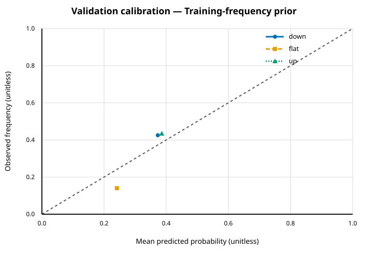
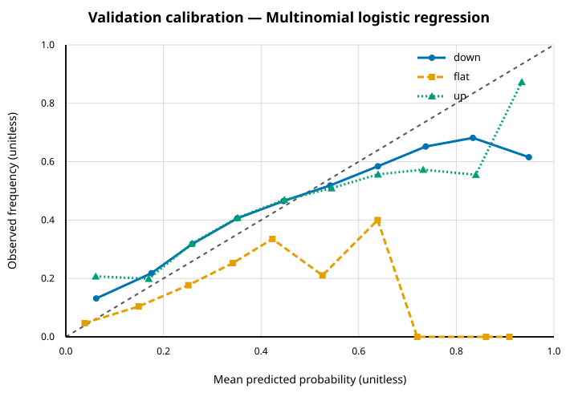
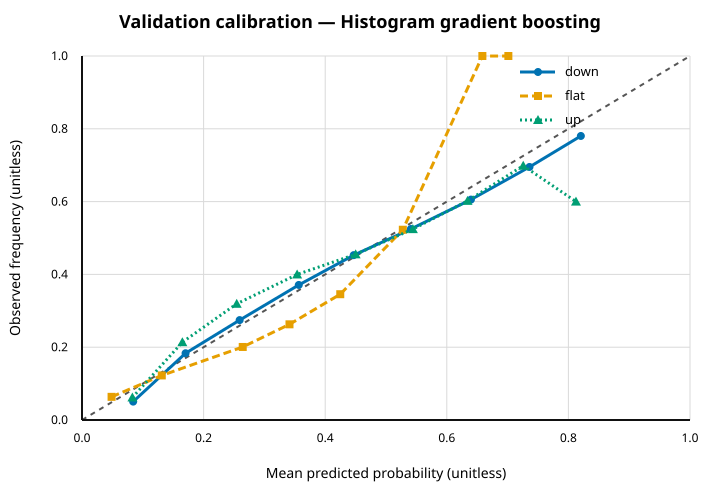
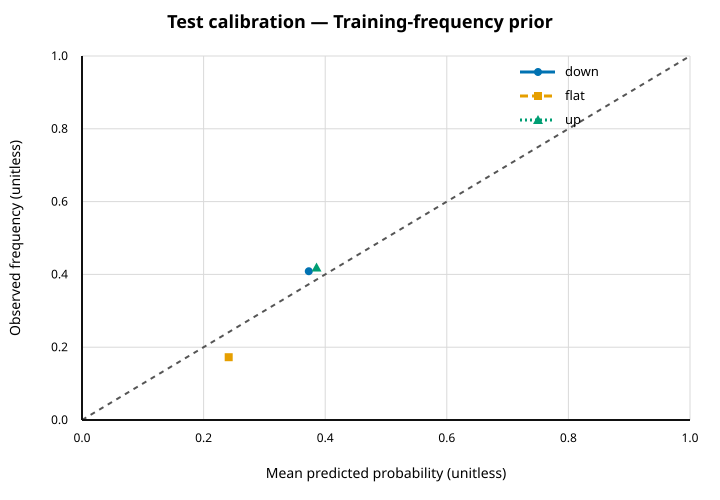
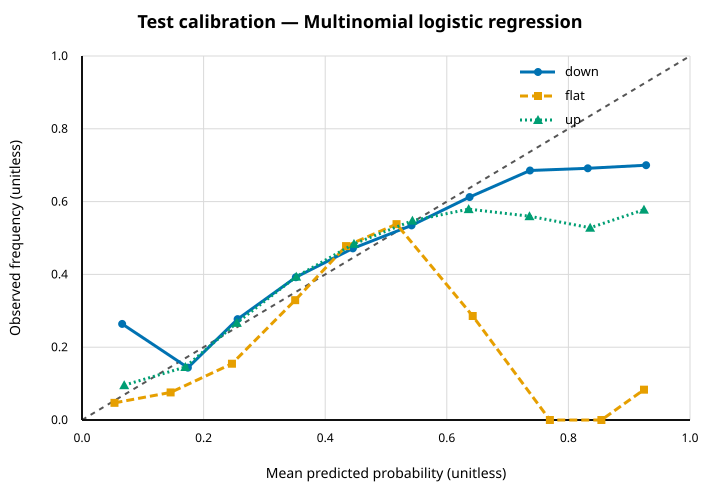
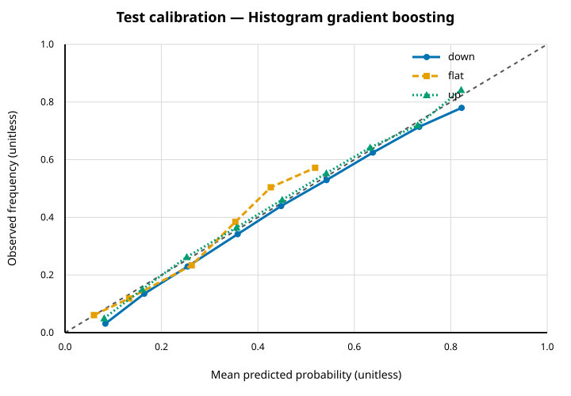

# Predictive research report

Experiment `20260821T181625.772904000Z-01c0e689bac1`.

This is an offline historical predictive-research report. It is not a live-trading system, trading advice or evidence of profitability; execution results follow in a separate conservative section.

## Scope and status

The report covers the frozen predictive experiment only: authenticated lineage, chronological partitions, features, model selection, validation/test metrics and calibration. Test data were evaluated once after validation selection.

Source identities are recorded without redistributing input bytes. The reviewer remains responsible for confirming source authorisation and whether an input is synthetic.

## Limitations and non-claims

- Predictive metrics remain descriptive and are not evidence of executable profitability.
- Nasdaq visible order-book data do not reveal hidden liquidity, off-venue activity, market impact or counterfactual participant behaviour.
- Predictive classification metrics do not establish economic value or executable performance.
- Results are historical and local; there is no profitability guarantee.

### Recorded warnings

- A new immutable run was explicitly forced for this identity.

## Data and code lineage

| Stage | Run ID | Manifest SHA-256 | Config SHA-256 | Identity SHA-256 | Status |
| --- | --- | --- | --- | --- | --- |
| experiment | 20260821T181625.772904000Z-01c0e689bac1 | c65bf29bde4b7ce17a3dd819bbdc8daf2ff140130cd4e90385ca12d94c174fb1 | cc26dc82775782354c1750b50c3430db824140a42e100aafe677993768268084 | 01c0e689bac1570254372dad0c1efc76c42cbdd8c54fdd73fae5b105c4a23e45 | completed |
| dataset | 20260821T180641.067291000Z-bcdb1ae22a29 | c5d69d774fdfd094540c9393f87106e0675cb5e0e0e7cfd9016950c65bdef113 | ec73910eb30797d8e03eff8a6cf45ece797047d0088cb314317b2a8eb3a17e9d | bcdb1ae22a292f06dfa4ac7730228c573a7bbe93d1d995963b9dfb1d0ecfaf98 | completed |
| conversion | 20260821T180335.592249000Z-8e6d43b3e013 | 150e25a4cc10121ef82646776e28206b8e8db6f2a0a04a3e3a2c90620f8cf046 | 4c6bfe3db667037893bc55676d6b4c35bb687813db1936372268b5bdb46ef7ae | 8e6d43b3e013278e48dbbad5e6c239eac47c1bd8d7daf364bd792b235b5b4087 | completed |
| replay | 20260821T165837.436440000Z-7bb0da7c2f45 | 72dc74772eecaadcd9c57b4af239ee8139e94afbbc35bc312cae957c2973d94a | fde3dbd06e0e79f262c9ff6ccaede011294845d5ef22bb9572462bf7a5d3646f | 7bb0da7c2f454e55571583e51d59428777a11acf50ceeee5706fdd01fb9fe78f | completed |
| replay | 20260821T165837.436440000Z-cb17d1ecb6ac | e013349ee58ae8ed5d1f53426a267ab816911a9fd607d847183908d02000d4bc | f954b2d150844b33d1ad117ec70216b1ddf2160a867c7947c836a2282ad39c58 | cb17d1ecb6acd854545926c6173979992028b577b342ba307d186f9979354972 | completed |
| replay | 20260821T165837.436841000Z-972055e967e0 | fdf06dc29b5d4045d5f45d6467d4d0ac80dfd70a396d8382c6f036ef82baf1b1 | 33d2bfe7a71ed95378b181b54b31fd7e3fa1856fe07f5af14ebcd583963c09e8 | 972055e967e05c17620a8d26ea652633bcaff05d22b1c6619ab4fa4c430fc990 | completed |

### Source and replay evidence

| Trading date | Source basename | Source SHA-256 | Bytes | Replay ID | Git revision | Publishable |
| --- | --- | --- | --- | --- | --- | --- |
| 2019-07-30 | 07302019.NASDAQ\_ITCH50.gz | c65784c48c28735901ae442dc00e215834218a359bc12a139ab4eec209bc2d4a | 3662140094 | 20260821T165837.436440000Z-7bb0da7c2f45 | b92f32b0d4bdf304a86b14d00ff4f5062437db76 | yes |
| 2019-10-30 | 10302019.NASDAQ\_ITCH50.gz | 0ad86b61a0eb7f1bce2cffca0e08c8658026451c68657ea6b06f61ff3710b999 | 3872931242 | 20260821T165837.436440000Z-cb17d1ecb6ac | b92f32b0d4bdf304a86b14d00ff4f5062437db76 | yes |
| 2019-12-30 | 12302019.NASDAQ\_ITCH50.gz | ef03df46a27e6bda4dead017f84c2e3979df7211f02c7868b51d53fceb99c689 | 3524013057 | 20260821T165837.436841000Z-972055e967e0 | b92f32b0d4bdf304a86b14d00ff4f5062437db76 | yes |

### Python tool identities

| Stage | Version | Package SHA-256 | Python | PyArrow |
| --- | --- | --- | --- | --- |
| experiment | 0.1.0 | 1b82ff8d7007752de88003a4650ebec737ceb13e2bb48c3af77366f76367d5fb | 3.11.5 | 23.0.1 |
| dataset | 0.1.0 | 1b82ff8d7007752de88003a4650ebec737ceb13e2bb48c3af77366f76367d5fb | 3.11.5 | 23.0.1 |
| conversion 20260821T180335.592249000Z-8e6d43b3e013 | 0.1.0 | 1b82ff8d7007752de88003a4650ebec737ceb13e2bb48c3af77366f76367d5fb | 3.11.5 | 23.0.1 |

Replay Git revisions identify the C++ replay code. Python stages are identified by their recorded package-content SHA-256 values.

## Dataset and chronological splits

| Partition | Dates | Qualifying | Dropped history | Dropped primary tail | Dropped stride | Retained | Down | Flat | Up |
| --- | --- | --- | --- | --- | --- | --- | --- | --- | --- |
| train | 2019-07-30 | 2210200 | 1500 | 300 | 1987558 | 220842 | 82373 | 53286 | 85183 |
| validation | 2019-10-30 | 1542057 | 1500 | 300 | 1386231 | 154026 | 65520 | 21584 | 66922 |
| test | 2019-12-30 | 2293654 | 1500 | 300 | 2062668 | 229186 | 93667 | 39535 | 95984 |

Partitions contain complete non-overlapping chronological days. Features were computed from current/past information; primary labels were computed separately and joined by immutable row identity.

## Feature definitions

| Feature | Dtype | Nullable | Formula | Lookback | Unit | Null policy |
| --- | --- | --- | --- | --- | --- | --- |
| spread\_ticks | float64 | no | \(ask\_price4\_1-bid\_price4\_1\)/tick\_size4 | current:None | ticks | never |
| imbalance\_1 | float64 | yes | \(B\(1\)-A\(1\)\)/\(B\(1\)\+A\(1\)\) | current:None | ratio | zero\_denominator |
| imbalance\_5 | float64 | yes | \(B\(5\)-A\(5\)\)/\(B\(5\)\+A\(5\)\) | current:None | ratio | zero\_denominator |
| imbalance\_10 | float64 | yes | \(B\(10\)-A\(10\)\)/\(B\(10\)\+A\(10\)\) | current:None | ratio | zero\_denominator |
| microprice4 | float64 | no | \(ask\_price4\_1\*B\(1\)\+bid\_price4\_1\*A\(1\)\)/\(B\(1\)\+A\(1\)\) | current:None | price4 | never |
| microprice\_displacement\_ticks | float64 | no | \(microprice4-\(bid\_price4\_1\+ask\_price4\_1\)/2\)/tick\_size4 | current:None | ticks | never |
| aggressor\_sign | int8 | yes | -resting\_side for an exact execute or execute\_price trigger | current:None | sign | no\_observable\_execution\_trigger |
| session\_progress | float64 | no | clip\(\(timestamp\_ns-session\_start\_ns\)/\(session\_end\_ns-session\_start\_ns\),0,1\) | current:None | fraction | never |
| session\_progress\_squared | float64 | no | session\_progress^2 | current:None | fraction\_squared | never |
| ofi\_20 | float64 | yes | sum\(e\_j\) over 20 qualifying transitions | qualifying\_transitions:20 | shares | incomplete\_history |
| ofi\_normalised\_20 | float64 | yes | ofi\_20/sum\(B\(1\)\+A\(1\)\) over the same transitions | qualifying\_transitions:20 | ratio | incomplete\_history\_or\_zero\_denominator |
| realised\_volatility\_20 | float64 | yes | sqrt\(sum\(log\(mid\_j/mid\_\(j-1\)\)^2\)\) over 20 transitions | qualifying\_transitions:20 | unannualised\_volatility | incomplete\_history |
| execution\_imbalance\_20 | float64 | yes | signed eligible E/C quantity / total eligible E/C quantity | qualifying\_transitions:20 | ratio | incomplete\_history\_then\_zero\_without\_execution |
| ofi\_100 | float64 | yes | sum\(e\_j\) over 100 qualifying transitions | qualifying\_transitions:100 | shares | incomplete\_history |
| ofi\_normalised\_100 | float64 | yes | ofi\_100/sum\(B\(1\)\+A\(1\)\) over the same transitions | qualifying\_transitions:100 | ratio | incomplete\_history\_or\_zero\_denominator |
| realised\_volatility\_100 | float64 | yes | sqrt\(sum\(log\(mid\_j/mid\_\(j-1\)\)^2\)\) over 100 transitions | qualifying\_transitions:100 | unannualised\_volatility | incomplete\_history |
| execution\_imbalance\_100 | float64 | yes | signed eligible E/C quantity / total eligible E/C quantity | qualifying\_transitions:100 | ratio | incomplete\_history\_then\_zero\_without\_execution |
| ofi\_500 | float64 | yes | sum\(e\_j\) over 500 qualifying transitions | qualifying\_transitions:500 | shares | incomplete\_history |
| ofi\_normalised\_500 | float64 | yes | ofi\_500/sum\(B\(1\)\+A\(1\)\) over the same transitions | qualifying\_transitions:500 | ratio | incomplete\_history\_or\_zero\_denominator |
| realised\_volatility\_500 | float64 | yes | sqrt\(sum\(log\(mid\_j/mid\_\(j-1\)\)^2\)\) over 500 transitions | qualifying\_transitions:500 | unannualised\_volatility | incomplete\_history |
| execution\_imbalance\_500 | float64 | yes | signed eligible E/C quantity / total eligible E/C quantity | qualifying\_transitions:500 | ratio | incomplete\_history\_then\_zero\_without\_execution |
| add\_bid\_rate\_100ms | float64 | yes | count\(add,bid\) in \(t-100000000ns,t\] / 0.1s | clock\_ns:100000000 | events\_per\_second | incomplete\_history |
| add\_ask\_rate\_100ms | float64 | yes | count\(add,ask\) in \(t-100000000ns,t\] / 0.1s | clock\_ns:100000000 | events\_per\_second | incomplete\_history |
| cancel\_delete\_bid\_rate\_100ms | float64 | yes | count\(cancel\_delete,bid\) in \(t-100000000ns,t\] / 0.1s | clock\_ns:100000000 | events\_per\_second | incomplete\_history |
| cancel\_delete\_ask\_rate\_100ms | float64 | yes | count\(cancel\_delete,ask\) in \(t-100000000ns,t\] / 0.1s | clock\_ns:100000000 | events\_per\_second | incomplete\_history |
| execution\_bid\_rate\_100ms | float64 | yes | count\(execution,bid\) in \(t-100000000ns,t\] / 0.1s | clock\_ns:100000000 | events\_per\_second | incomplete\_history |
| execution\_ask\_rate\_100ms | float64 | yes | count\(execution,ask\) in \(t-100000000ns,t\] / 0.1s | clock\_ns:100000000 | events\_per\_second | incomplete\_history |
| add\_bid\_rate\_1s | float64 | yes | count\(add,bid\) in \(t-1000000000ns,t\] / 1s | clock\_ns:1000000000 | events\_per\_second | incomplete\_history |
| add\_ask\_rate\_1s | float64 | yes | count\(add,ask\) in \(t-1000000000ns,t\] / 1s | clock\_ns:1000000000 | events\_per\_second | incomplete\_history |
| cancel\_delete\_bid\_rate\_1s | float64 | yes | count\(cancel\_delete,bid\) in \(t-1000000000ns,t\] / 1s | clock\_ns:1000000000 | events\_per\_second | incomplete\_history |
| cancel\_delete\_ask\_rate\_1s | float64 | yes | count\(cancel\_delete,ask\) in \(t-1000000000ns,t\] / 1s | clock\_ns:1000000000 | events\_per\_second | incomplete\_history |
| execution\_bid\_rate\_1s | float64 | yes | count\(execution,bid\) in \(t-1000000000ns,t\] / 1s | clock\_ns:1000000000 | events\_per\_second | incomplete\_history |
| execution\_ask\_rate\_1s | float64 | yes | count\(execution,ask\) in \(t-1000000000ns,t\] / 1s | clock\_ns:1000000000 | events\_per\_second | incomplete\_history |

## Models and validation selection

Selection metric: `multiclass\_log\_loss`; tie tolerance: 0.000001.

| Model | Status | Selected parameters | Validation log loss |
| --- | --- | --- | --- |
| Training-frequency prior | completed | \{"fit\_rows":220842,"source":"training\_class\_frequencies"\} | 1.032655 |
| Multinomial logistic regression | completed | \{"C":0.01,"max\_iter":2000,"penalty":"l2","solver":"lbfgs"\} | 0.981207 |
| Histogram gradient boosting | completed | \{"early\_stopping":false,"l2\_regularization":1.0,"learning\_rate":0.05,"max\_iter":100,"max\_leaf\_nodes":15\} | 0.956477 |

### Every declared candidate

| Model | Parameters | Status | Validation log loss | Selection/reason |
| --- | --- | --- | --- | --- |
| Training-frequency prior | \{"fit\_rows":220842,"source":"training\_class\_frequencies"\} | completed | 1.032655 | Training-frequency baseline |
| Multinomial logistic regression | \{"C":0.01,"max\_iter":2000,"penalty":"l2","solver":"lbfgs"\} | completed | 0.981207 | Selected |
| Multinomial logistic regression | \{"C":0.1,"max\_iter":2000,"penalty":"l2","solver":"lbfgs"\} | completed | 0.986005 |  |
| Multinomial logistic regression | \{"C":1.0,"max\_iter":2000,"penalty":"l2","solver":"lbfgs"\} | completed | 0.986785 |  |
| Multinomial logistic regression | \{"C":10.0,"max\_iter":2000,"penalty":"l2","solver":"lbfgs"\} | completed | 0.986976 |  |
| Histogram gradient boosting | \{"early\_stopping":false,"l2\_regularization":0.0,"learning\_rate":0.05,"max\_iter":100,"max\_leaf\_nodes":15\} | completed | 0.956493 |  |
| Histogram gradient boosting | \{"early\_stopping":false,"l2\_regularization":1.0,"learning\_rate":0.05,"max\_iter":100,"max\_leaf\_nodes":15\} | completed | 0.956477 | Selected |
| Histogram gradient boosting | \{"early\_stopping":false,"l2\_regularization":0.0,"learning\_rate":0.05,"max\_iter":100,"max\_leaf\_nodes":31\} | completed | 0.959625 |  |
| Histogram gradient boosting | \{"early\_stopping":false,"l2\_regularization":1.0,"learning\_rate":0.05,"max\_iter":100,"max\_leaf\_nodes":31\} | completed | 0.960328 |  |
| Histogram gradient boosting | \{"early\_stopping":false,"l2\_regularization":0.0,"learning\_rate":0.1,"max\_iter":100,"max\_leaf\_nodes":15\} | completed | 0.959286 |  |
| Histogram gradient boosting | \{"early\_stopping":false,"l2\_regularization":1.0,"learning\_rate":0.1,"max\_iter":100,"max\_leaf\_nodes":15\} | completed | 0.959307 |  |
| Histogram gradient boosting | \{"early\_stopping":false,"l2\_regularization":0.0,"learning\_rate":0.1,"max\_iter":100,"max\_leaf\_nodes":31\} | completed | 0.965391 |  |
| Histogram gradient boosting | \{"early\_stopping":false,"l2\_regularization":1.0,"learning\_rate":0.1,"max\_iter":100,"max\_leaf\_nodes":31\} | completed | 0.965825 |  |

Failed candidates are retained rather than silently removed.

## Validation and test metrics

### Validation aggregate

| Model | Rows | Down | Flat | Up | Log loss | Balanced accuracy | Macro F1 |
| --- | --- | --- | --- | --- | --- | --- | --- |
| Training-frequency prior | 154026 | 65520 | 21584 | 66922 | 1.032655 | 0.333333 | 0.201924 |
| Multinomial logistic regression | 154026 | 65520 | 21584 | 66922 | 0.981207 | 0.401512 | 0.402131 |
| Histogram gradient boosting | 154026 | 65520 | 21584 | 66922 | 0.956477 | 0.406569 | 0.405653 |

### Test aggregate

| Model | Rows | Down | Flat | Up | Log loss | Balanced accuracy | Macro F1 |
| --- | --- | --- | --- | --- | --- | --- | --- |
| Training-frequency prior | 229186 | 93667 | 39535 | 95984 | 1.047280 | 0.333333 | 0.196787 |
| Multinomial logistic regression | 229186 | 93667 | 39535 | 95984 | 0.959359 | 0.476758 | 0.481665 |
| Histogram gradient boosting | 229186 | 93667 | 39535 | 95984 | 0.931047 | 0.458761 | 0.466002 |

Confidence intervals:

- Training-frequency prior: Omitted over 1 test day\(s\): fewer\_than\_five\_trading\_days.
- Multinomial logistic regression: Omitted over 1 test day\(s\): fewer\_than\_five\_trading\_days.
- Histogram gradient boosting: Omitted over 1 test day\(s\): fewer\_than\_five\_trading\_days.

### Per-symbol test metrics

| Model | Symbol | Rows | Down | Flat | Up | Log loss | Balanced accuracy | Macro F1 |
| --- | --- | --- | --- | --- | --- | --- | --- | --- |
| Training-frequency prior | AAPL | 109115 | 49266 | 7211 | 52638 | 0.998794 | 0.333333 | 0.216948 |
| Training-frequency prior | AMZN | 13427 | 6716 | 101 | 6610 | 0.972953 | 0.333333 | 0.219926 |
| Training-frequency prior | MSFT | 106644 | 37685 | 32223 | 36736 | 1.106249 | 0.333333 | 0.170810 |
| Multinomial logistic regression | AAPL | 109115 | 49266 | 7211 | 52638 | 0.905140 | 0.380200 | 0.367292 |
| Multinomial logistic regression | AMZN | 13427 | 6716 | 101 | 6610 | 0.832139 | 0.354965 | 0.341182 |
| Multinomial logistic regression | MSFT | 106644 | 37685 | 32223 | 36736 | 1.030852 | 0.463814 | 0.463406 |
| Histogram gradient boosting | AAPL | 109115 | 49266 | 7211 | 52638 | 0.875278 | 0.391004 | 0.377646 |
| Histogram gradient boosting | AMZN | 13427 | 6716 | 101 | 6610 | 0.707749 | 0.392251 | 0.386465 |
| Histogram gradient boosting | MSFT | 106644 | 37685 | 32223 | 36736 | 1.016222 | 0.458218 | 0.453744 |

### Confusion matrices

Rows are true classes and columns are predicted classes in down/flat/up order.

#### Validation — Training-frequency prior

| True class | Predicted down | Predicted flat | Predicted up |
| --- | --- | --- | --- |
| down | 0 | 0 | 65520 |
| flat | 0 | 0 | 21584 |
| up | 0 | 0 | 66922 |

#### Validation — Multinomial logistic regression

| True class | Predicted down | Predicted flat | Predicted up |
| --- | --- | --- | --- |
| down | 31980 | 3206 | 30334 |
| flat | 8894 | 2792 | 9898 |
| up | 24206 | 3427 | 39289 |

#### Validation — Histogram gradient boosting

| True class | Predicted down | Predicted flat | Predicted up |
| --- | --- | --- | --- |
| down | 35295 | 2657 | 27568 |
| flat | 10272 | 2416 | 8896 |
| up | 25888 | 2950 | 38084 |

#### Test — Training-frequency prior

| True class | Predicted down | Predicted flat | Predicted up |
| --- | --- | --- | --- |
| down | 0 | 0 | 93667 |
| flat | 0 | 0 | 39535 |
| up | 0 | 0 | 95984 |

#### Test — Multinomial logistic regression

| True class | Predicted down | Predicted flat | Predicted up |
| --- | --- | --- | --- |
| down | 45515 | 9296 | 38856 |
| flat | 11517 | 14998 | 13020 |
| up | 32832 | 8922 | 54230 |

#### Test — Histogram gradient boosting

| True class | Predicted down | Predicted flat | Predicted up |
| --- | --- | --- | --- |
| down | 53141 | 5543 | 34983 |
| flat | 15394 | 9489 | 14652 |
| up | 35888 | 5488 | 54608 |

## Negative results and interpretation

All learned-model test metrics improved on the prior in this run, but predictive improvement alone is not evidence of executable or profitable performance. No declared validation candidate failed in this run.

| Model | Metric | Prior | Model | Delta model-prior | Interpretation |
| --- | --- | --- | --- | --- | --- |
| Multinomial logistic regression | Multiclass log loss | 1.047280 | 0.959359 | -0.087921 | improved |
| Multinomial logistic regression | Balanced accuracy | 0.333333 | 0.476758 | 0.143425 | improved |
| Multinomial logistic regression | Macro F1 | 0.196787 | 0.481665 | 0.284878 | improved |
| Histogram gradient boosting | Multiclass log loss | 1.047280 | 0.931047 | -0.116234 | improved |
| Histogram gradient boosting | Balanced accuracy | 0.333333 | 0.458761 | 0.125428 | improved |
| Histogram gradient boosting | Macro F1 | 0.196787 | 0.466002 | 0.269214 | improved |

These held-out comparisons are reported after selection and are not used to retune features, hyperparameters or selection rules.

## Calibration

The dashed diagonal represents perfect one-vs-rest calibration. Plot data are available in [calibration.json](plot-data/calibration.json).

### Validation — Training-frequency prior



*Caption:* One-vs-rest calibration for Training-frequency prior on the validation partition.

Text summary: down: 1/10 populated bins, largest absolute gap 0.0524; flat: 1/10 populated bins, largest absolute gap 0.1012; up: 1/10 populated bins, largest absolute gap 0.0488.

### Validation — Multinomial logistic regression



*Caption:* One-vs-rest calibration for Multinomial logistic regression on the validation partition.

Text summary: down: 10/10 populated bins, largest absolute gap 0.3333; flat: 10/10 populated bins, largest absolute gap 0.9089; up: 10/10 populated bins, largest absolute gap 0.2849.

### Validation — Histogram gradient boosting



*Caption:* One-vs-rest calibration for Histogram gradient boosting on the validation partition.

Text summary: down: 9/10 populated bins, largest absolute gap 0.0408; flat: 8/10 populated bins, largest absolute gap 0.3415; up: 9/10 populated bins, largest absolute gap 0.2125.

### Test — Training-frequency prior



*Caption:* One-vs-rest calibration for Training-frequency prior on the test partition.

Text summary: down: 1/10 populated bins, largest absolute gap 0.0357; flat: 1/10 populated bins, largest absolute gap 0.0688; up: 1/10 populated bins, largest absolute gap 0.0331.

### Test — Multinomial logistic regression



*Caption:* One-vs-rest calibration for Multinomial logistic regression on the test partition.

Text summary: down: 10/10 populated bins, largest absolute gap 0.2278; flat: 10/10 populated bins, largest absolute gap 0.8543; up: 10/10 populated bins, largest absolute gap 0.3465.

### Test — Histogram gradient boosting



*Caption:* One-vs-rest calibration for Histogram gradient boosting on the test partition.

Text summary: down: 9/10 populated bins, largest absolute gap 0.0524; flat: 6/10 populated bins, largest absolute gap 0.0775; up: 9/10 populated bins, largest absolute gap 0.0312.

## Reproduction

Run from the repository root. Obtain authorised source files matching the recorded basenames and SHA-256 values; the application does not download them.

Canonical configuration snapshots:

- [Experiment config](configs/experiment.json)
- [Dataset config](configs/dataset.json)

    ./build/release/itchlab replay --config runs/report/20260822T000247.776720000Z-55a2f298d636/both/configs/replay-20260821T165837.436440000Z-7bb0da7c2f45.json --output-root runs
    ./build/release/itchlab validate --run runs/replay/20260821T165837.436440000Z-7bb0da7c2f45 --deep
    ./build/release/itchlab replay --config runs/report/20260822T000247.776720000Z-55a2f298d636/both/configs/replay-20260821T165837.436440000Z-cb17d1ecb6ac.json --output-root runs
    ./build/release/itchlab validate --run runs/replay/20260821T165837.436440000Z-cb17d1ecb6ac --deep
    ./build/release/itchlab replay --config runs/report/20260822T000247.776720000Z-55a2f298d636/both/configs/replay-20260821T165837.436841000Z-972055e967e0.json --output-root runs
    ./build/release/itchlab validate --run runs/replay/20260821T165837.436841000Z-972055e967e0 --deep
    python -m itchlab_research convert --config runs/report/20260822T000247.776720000Z-55a2f298d636/both/configs/conversion-20260821T180335.592249000Z-8e6d43b3e013.json
    python -m itchlab_research build-dataset --config runs/report/20260822T000247.776720000Z-55a2f298d636/both/configs/dataset.json
    python -m itchlab_research train --config runs/report/20260822T000247.776720000Z-55a2f298d636/both/configs/experiment.json
    python -m itchlab_research report --run-id 20260821T181625.772904000Z-01c0e689bac1 --output-format both

Reproduction is incomplete if source hashes, recorded configs, manifest hashes or package-content identities do not match.

---

# Conservative simulation comparison

Simulation `20260822T000247.776720000Z-55a2f298d636`. Historical research only; this is not a live-trading system, trading advice or evidence of profitability.

## Selection frozen before test

Validation log loss selected `hist\_gradient\_boosting`. Validation-day P&L selected signal weight `2.0` ticks under the fixed 100 microsecond, −2000 microusd/share scenario.

## Test latency and cost sensitivity

| Scenario | Strategy | Signal weight \(ticks\) | Submission latency \(ns\) | Cancellation latency \(ns\) | Maker cost \(microusd/share\) | Taker cost \(microusd/share\) | Passive fills | Maximum absolute inventory | Marked P&amp;L \(microusd\) | Spread capture \(microusd\) | Inventory mark-to-market \(microusd\) | Liquidation slippage \(microusd\) | Signed fees \(microusd\) | Maximum drawdown \(microusd\) | Turnover \(microusd\) | 100 ms adverse selection \(microusd\) | Markout coverage |
| --- | --- | --- | --- | --- | --- | --- | --- | --- | --- | --- | --- | --- | --- | --- | --- | --- | --- |
| latency-0-maker--2000 | inventory\_aware\_avellaneda\_stoikov | 0.0 | 0 | 0 | -2000 | 3000 | 967 | \{'1': 255, '2': 283, '3': 141\} | -104018000 | 779135000 | -1002010000 | -3645000 | -122502000 | 383820000 | 21136208100000 | 849065000 | 1.0 |
| latency-0-maker--2000 | signal\_adjusted\_avellaneda\_stoikov | 2.0 | 0 | 0 | -2000 | 3000 | 806 | \{'1': 309, '2': 291, '3': 141\} | 61236000 | 721045000 | -759140000 | -2805000 | -102136000 | 320966000 | 18069525300000 | 753590000 | 1.0 |
| latency-0-maker-3000 | inventory\_aware\_avellaneda\_stoikov | 0.0 | 0 | 0 | 3000 | 3000 | 967 | \{'1': 255, '2': 283, '3': 141\} | -411128000 | 779135000 | -1002010000 | -3645000 | 184608000 | 545323000 | 21136208100000 | 849065000 | 1.0 |
| latency-0-maker-3000 | signal\_adjusted\_avellaneda\_stoikov | 2.0 | 0 | 0 | 3000 | 3000 | 806 | \{'1': 309, '2': 291, '3': 141\} | -195184000 | 721045000 | -759140000 | -2805000 | 154284000 | 393609000 | 18069525300000 | 753590000 | 1.0 |
| latency-100000-maker--2000 | inventory\_aware\_avellaneda\_stoikov | 0.0 | 100000 | 100000 | -2000 | 3000 | 1010 | \{'1': 258, '2': 283, '3': 137\} | -425923000 | 794125000 | -1341285000 | -10540000 | -131777000 | 467652000 | 21885019180000 | 941290000 | 1.0 |
| latency-100000-maker--2000 | signal\_adjusted\_avellaneda\_stoikov | 2.0 | 100000 | 100000 | -2000 | 3000 | 812 | \{'1': 207, '2': 291, '3': 138\} | -182295000 | 673680000 | -951755000 | -4765000 | -100545000 | 338093000 | 17169388700000 | 775720000 | 1.0 |
| latency-100000-maker-3000 | inventory\_aware\_avellaneda\_stoikov | 0.0 | 100000 | 100000 | 3000 | 3000 | 1010 | \{'1': 258, '2': 283, '3': 137\} | -757698000 | 794125000 | -1341285000 | -10540000 | 199998000 | 790597000 | 21885019180000 | 941290000 | 1.0 |
| latency-100000-maker-3000 | signal\_adjusted\_avellaneda\_stoikov | 2.0 | 100000 | 100000 | 3000 | 3000 | 812 | \{'1': 207, '2': 291, '3': 138\} | -434910000 | 673680000 | -951755000 | -4765000 | 152070000 | 491034000 | 17169388700000 | 775720000 | 1.0 |
| latency-1000000-maker--2000 | inventory\_aware\_avellaneda\_stoikov | 0.0 | 1000000 | 1000000 | -2000 | 3000 | 1039 | \{'1': 255, '2': 285, '3': 142\} | -167012000 | 876645000 | -1164125000 | -10920000 | -131388000 | 492782000 | 23503213180000 | 968130000 | 1.0 |
| latency-1000000-maker--2000 | signal\_adjusted\_avellaneda\_stoikov | 2.0 | 1000000 | 1000000 | -2000 | 3000 | 866 | \{'1': 210, '2': 326, '3': 142\} | -46976000 | 785075000 | -941135000 | -2900000 | -111984000 | 523442000 | 20566039820000 | 826340000 | 1.0 |
| latency-1000000-maker-3000 | inventory\_aware\_avellaneda\_stoikov | 0.0 | 1000000 | 1000000 | 3000 | 3000 | 1039 | \{'1': 255, '2': 285, '3': 142\} | -498002000 | 876645000 | -1164125000 | -10920000 | 199602000 | 626070000 | 23503213180000 | 968130000 | 1.0 |
| latency-1000000-maker-3000 | signal\_adjusted\_avellaneda\_stoikov | 2.0 | 1000000 | 1000000 | 3000 | 3000 | 866 | \{'1': 210, '2': 326, '3': 142\} | -328046000 | 785075000 | -941135000 | -2900000 | 169086000 | 594012000 | 20566039820000 | 826340000 | 1.0 |

Turnover is absolute gross passive-plus-liquidation notional. Maximum drawdown uses the chronologically concatenated marked-equity path. Positive 100 ms adverse selection is unfavourable to the passive fill; coverage reports fills with an available future mark.

## Unfavourable findings and interpretation

- 11 of 12 strategy-scenario results had negative marked P&amp;L; 0 had no passive fills.
- 12 of 12 results had both measured markout coverage and positive \(unfavourable\) 100 ms adverse selection.
- The signal-adjusted strategy had lower marked P&amp;L than the inventory-aware baseline in 0 of 6 paired scenarios, higher marked P&amp;L in 6, and equal marked P&amp;L in 0.
- These test outcomes are reported without filtering; they are historical observations under the stated conservative assumptions, not evidence of profitability.

## Assumptions, anomalies and limitations

- Assumption: Only observed displayed E/C flow can fill simulated passive orders.
- Assumption: Changed quotes cancel first and wait for a later decision before replacement.
- Assumption: The adverse-selection proxy uses the first valid midpoint at or after 100 ms.
- Assumption: Terminal inventory crosses the last valid visible spread.
- Limitation: Historical replay cannot identify hidden liquidity or the full exchange queue.
- Limitation: No immediate fills, price improvement, market impact or live execution are modelled.
- Limitation: Results are conditional on selected symbols, dates, fees, latency and visible data quality.
- Queue/prediction diagnostics: DIAG\_COUNTERFACTUAL\_CROSS=16,474, DIAG\_MISSING\_PREDICTION=1,188, DIAG\_QUEUE\_EVENT\_SKIPPED=140, DIAG\_STALE\_PREDICTION=417,678.

## Reproduction

Run from the repository root after reproducing the authenticated replay, conversion, dataset and experiment parents shown in the predictive section/config snapshots.

```console
python -m itchlab_research simulate --config runs/report/20260822T000247.776720000Z-55a2f298d636/both/configs/simulation.json
python -m itchlab_research report --run-id 20260822T000247.776720000Z-55a2f298d636
```
